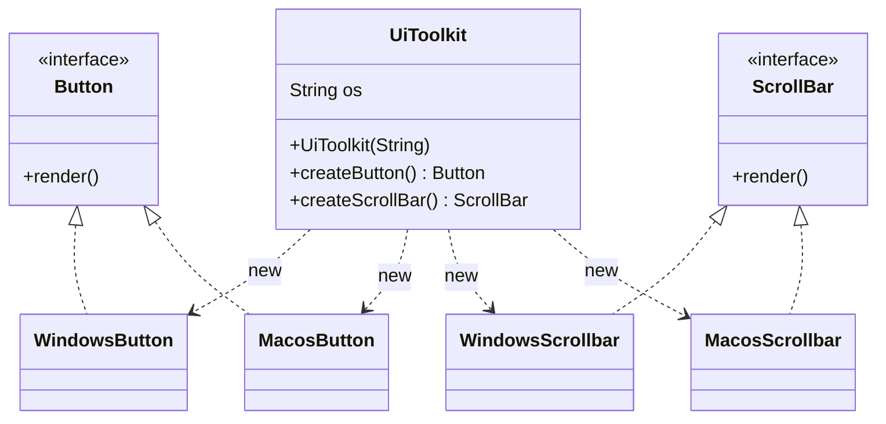
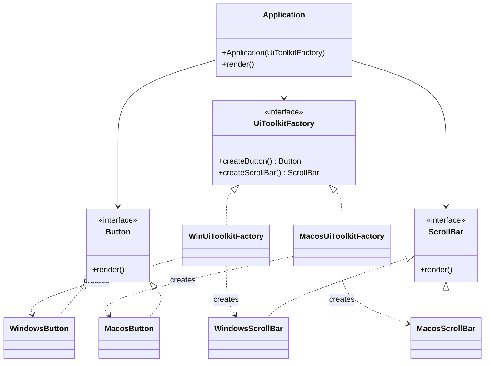

# Abstract Factory — UI Toolkit

**Week 2 · Creational**

## Intent
Provide an interface for creating *families* of related objects without specifying their concrete classes. Swapping the factory swaps the whole family, and the products are guaranteed to match.

## The problem (`main`)
- `UiToolkit` stores an `os` string and repeats the same `if ("MacOS") ... else if ("Windows") ... else null` in both `createButton()` and `createScrollBar()`.
- Each new product (for example `Checkbox`) means another copy of the chain, and each new OS (Linux) means editing every chain.
- An unknown OS returns `null`, which shows up later as a `NullPointerException`.
- Nothing structurally prevents mixing a Mac button with a Windows scrollbar.

## The solution (`solution/abstract-factory-uitoolkit`)
- `UiToolkitFactory` (Abstract Factory) declares `createButton()` and `createScrollBar()`.
- `WinUiToolkitFactory` and `MacosUiToolkitFactory` (Concrete Factories) each create one consistent family.
- `Button` and `ScrollBar` (Abstract Products) and `WindowsButton`/`MacosButton`/`WindowsScrollBar`/`MacosScrollBar` (Concrete Products) are unchanged apart from role comments; the scrollbar classes are renamed to match the `ScrollBar` interface's casing.
- `Application` (Client) receives a `UiToolkitFactory`, creates its button and scrollbar through it and renders them. It never names a concrete class, so the test runs it with both factories.
- The `os` string and the `if` chains are gone. A new OS is one new factory class.

## Before

## After

## Compare
[problem/abstract-factory-uitoolkit...solution/abstract-factory-uitoolkit](https://github.com/vamekh/ug-design-patterns-2025/compare/problem/abstract-factory-uitoolkit...solution/abstract-factory-uitoolkit)

## Discussion
- The client should hold a `UiToolkitFactory` (the abstract type) and receive it from one place that decides the OS at start-up. That single choice is the only OS check left in the program.
- Adding a new *family* (Linux) is easy. Adding a new *product* (`Checkbox`) means changing the interface and every factory, which is the pattern's known trade-off.
- Each concrete factory is usually needed only once, so it is often a Singleton.
- Related: Factory Method (each `createX()` is one), Simple Factory (to choose the concrete factory), Bridge.
