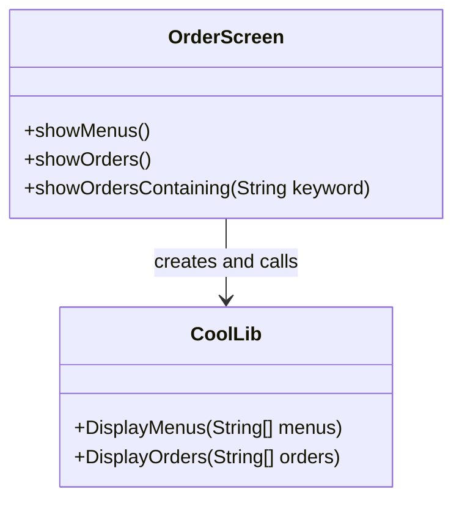
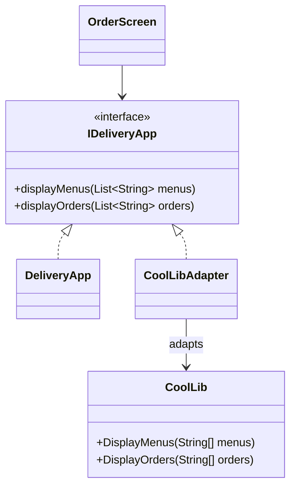

# Adapter — DeliveryApp

**Week 4 · Structural**

## Intent
Let our code use a third-party class through our own interface by placing a small adapter in between that translates the calls.

## The problem (`main`)
- `OrderScreen` works with `List<String>`, but the third-party `CoolLib` wants `String[]`.
- Every method (`showMenus`, `showOrders`, `showOrdersContaining`) converts with `toArray(...)` and calls `CoolLib` directly.
- `OrderScreen` creates `CoolLib` itself, so it cannot be given another display or a test double.
- Replacing the library means editing every call site.

## The solution (`solution/adapter-deliveryapp`)
- `IDeliveryApp` is the Target: `displayMenus(List)` and `displayOrders(List)`.
- `CoolLib` is the Adaptee and stays untouched (its odd `DisplayMenus(String[])` API included).
- `CoolLibAdapter` implements `IDeliveryApp` and does the List-to-array conversion once.
- `DeliveryApp` is our plain implementation; `OrderScreen` (Client) receives any `IDeliveryApp`.

## Before

## After

## Compare
[problem/adapter-deliveryapp...solution/adapter-deliveryapp](https://github.com/vamekh/ug-design-patterns-2025/compare/problem/adapter-deliveryapp...solution/adapter-deliveryapp)

## Discussion
- Wrapping third-party APIs behind your own interface keeps vendor types out of your code and makes swapping or faking them easy.
- Cost: one more class and a translation layer; keep the adapter thin and free of business logic.
- Related: Facade (simplifies a whole subsystem rather than converting one interface), Decorator, Dependency Inversion (DIP).
