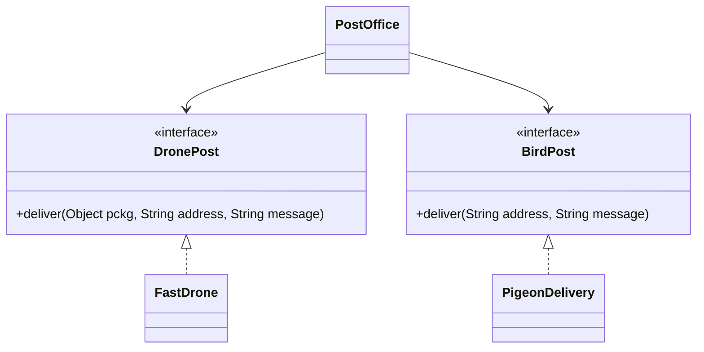
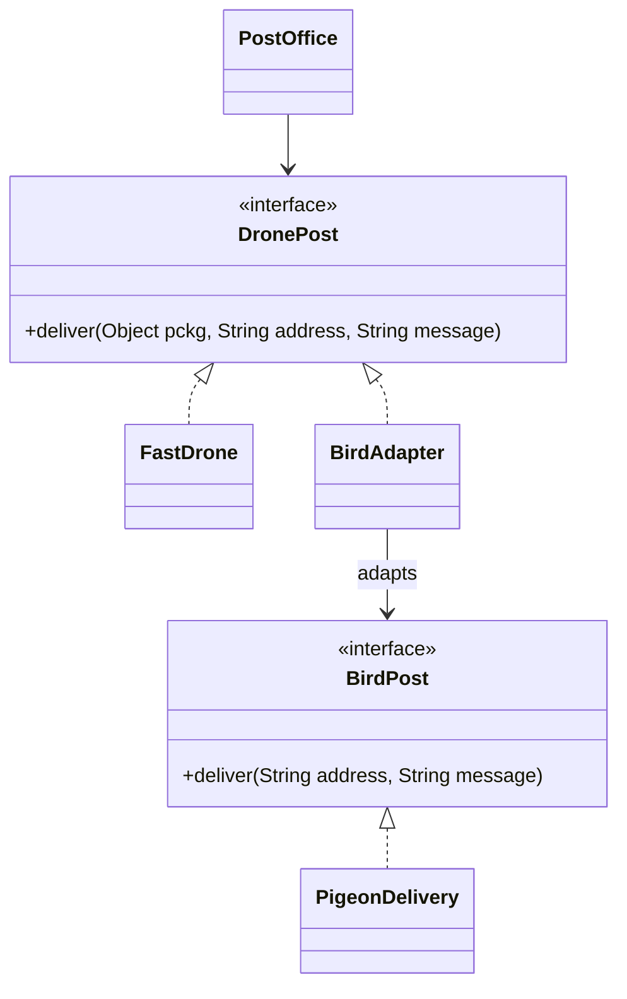

# Adapter — PigeonDrone

**Week 4 · Structural**

## Intent
Convert the interface of an existing class into the interface the client expects, so classes with incompatible interfaces can work together.

## The problem (`main`)
- `PostOffice` holds both a `DronePost` and a `BirdPost` field, with a constructor for each.
- `deliver()` has an `if (birdPost != null)` branch that translates the drone call into the bird call.
- The client contains the conversion logic (dropping the package for pigeons).
- Each new carrier with its own API means a new field, constructor and branch in `PostOffice`.

## The solution (`solution/adapter-pigeondrone`)
- `DronePost` is the Target interface the client uses; `FastDrone` implements it natively.
- `BirdPost` / `PigeonDelivery` is the Adaptee with an incompatible `deliver(address, message)`.
- `BirdAdapter` implements `DronePost` and delegates to a `BirdPost`, dropping the package in one place.
- `PostOffice` (Client) has a single `DronePost` field and no branching.

## Before

## After

## Compare
[problem/adapter-pigeondrone...solution/adapter-pigeondrone](https://github.com/vamekh/ug-design-patterns-2025/compare/problem/adapter-pigeondrone...solution/adapter-pigeondrone)

## Discussion
- Use it to plug legacy or third-party code into an interface you already depend on, without changing either side.
- The adapter cannot invent missing capabilities: here the package is lost, which the client may not expect (a hint of an LSP problem).
- Related: Decorator (same interface, adds behaviour), Facade (new simpler interface over many classes), Bridge (designed up front, not retrofitted).
