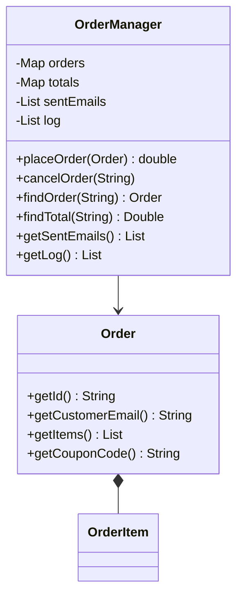
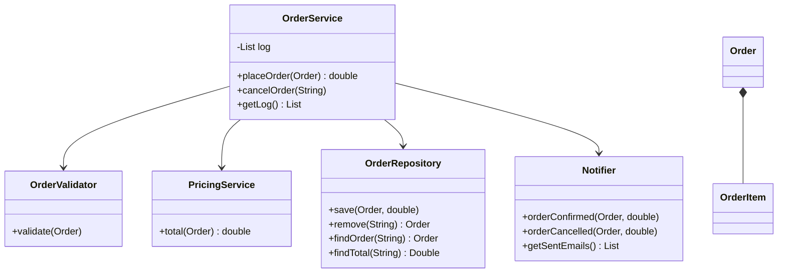

# God Object — OrderManager

**Week 12 · Anti-pattern**

## Intent
A God Object is one class that knows and does too much: it collects unrelated responsibilities until every change and every test goes through it. It hurts because it breaks SRP. Changes collide in one file, no part can be reused or tested alone, and the class only grows.

## The problem (`main`)
- `OrderManager.placeOrder()` validates the order, computes subtotal, coupon, bulk discount and 18% tax, stores the order in two maps, "sends" an e-mail and writes a log line, all in one method.
- `cancelOrder()` repeats the same mix: validation, persistence, notification and logging again.
- Five reasons to change share one file: a new coupon, a new tax rule, a real database, SMS instead of e-mail, a different log format.
- `OrderManagerTest` can only check a pricing rule by placing a full, valid order. There is no way to test pricing or validation in isolation.

## The solution (`solution/antipattern-god-object`)
- `OrderValidator` checks that an order is well-formed (id, e-mail, items).
- `PricingService` computes the total: subtotal, coupons, bulk discount and tax.
- `OrderRepository` stores and finds orders, and rejects duplicates and unknown ids.
- `Notifier` formats and records the customer e-mails.
- `OrderService` is a thin orchestrator. It takes the four collaborators through its constructor, calls them in order and keeps the log.
- `Order` and `OrderItem` are unchanged. The same scenarios pass, and the new tests also exercise `PricingService`, `OrderValidator` and `Notifier` on their own.

## Before

## After

## Compare
[problem/antipattern-god-object...solution/antipattern-god-object](https://github.com/vamekh/ug-design-patterns-2025/compare/problem/antipattern-god-object...solution/antipattern-god-object)

## Discussion
- Warning signs: names like `Manager`, `Helper` or `Util`, hundreds of lines, many unrelated fields, and tests that need lots of setup to check one rule.
- Refactor by grouping code by *reason to change* (SRP), then injecting the pieces (DIP). The orchestrator should read like a recipe.
- Cost: more classes and constructor wiring. Don't split a class that has only one reason to change.
- Related: Facade (`OrderService` is a facade over the subsystem), Strategy (the next step could be a `PricingService` per customer type), Repository.
