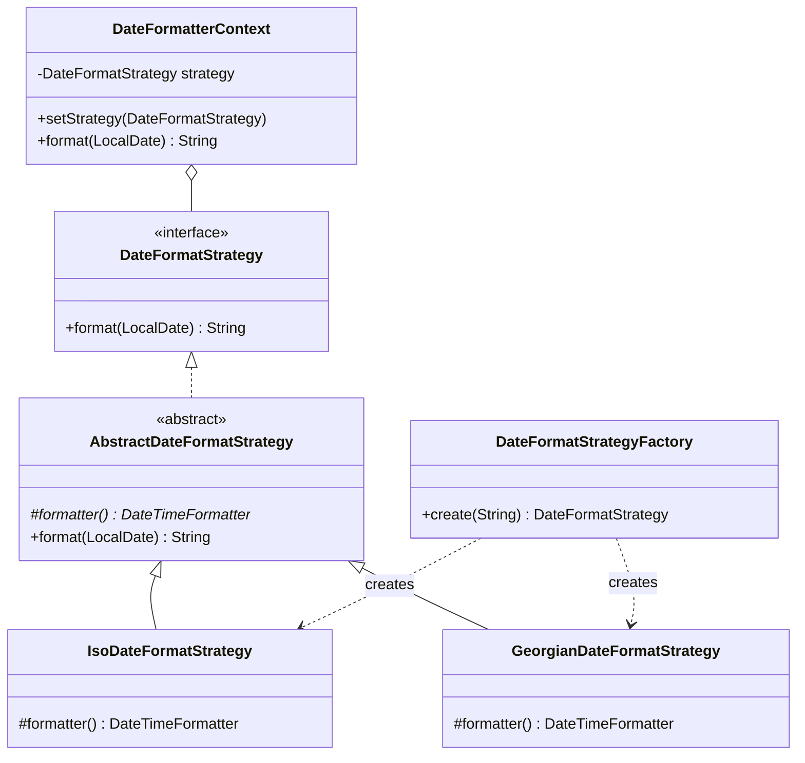
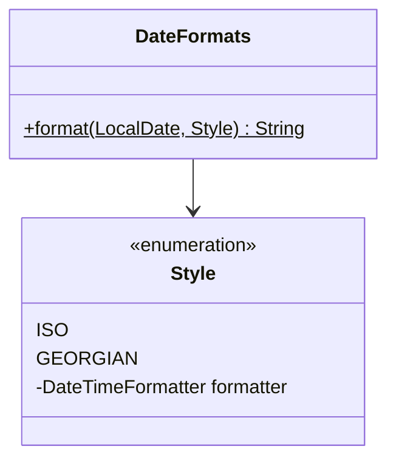

# Golden Hammer — Date Formatting

**Week 12 · Anti-pattern**

## Intent
Golden Hammer: "if all you have is a hammer, everything looks like a nail." A familiar tool, here design patterns themselves, gets applied everywhere whether or not the problem needs it. It hurts because every pattern adds types, indirection and reading cost. When the variation it prepares for never comes, that cost buys nothing.

## The problem (`main`)
- Formatting a `LocalDate` in one of two fixed ways is spread over six types: `DateFormatStrategy`, `AbstractDateFormatStrategy`, `IsoDateFormatStrategy`, `GeorgianDateFormatStrategy`, `DateFormatStrategyFactory` and `DateFormatterContext`.
- The real logic is one `DateTimeFormatter` per format. Finding the actual pattern string means jumping through four files.
- `DateFormatterContext.setStrategy()` and the abstract base class are "flexibility" that nothing uses.
- The factory takes a `String`, so a typo like `"US"` fails only at runtime.

## The solution (`solution/antipattern-golden-hammer`)
- `DateFormats` is one small final class with a static `format(LocalDate, Style)` method.
- The `Style` enum (`ISO`, `GEORGIAN`) maps each option straight to a `java.time.format.DateTimeFormatter`.
- The patterns are deleted. The same three scenarios pass, and the test is one call per case.
- A typo in a style name is now usually a compile error. `Style.valueOf()` still rejects bad user input.

## Before

## After

## Compare
[problem/antipattern-golden-hammer...solution/antipattern-golden-hammer](https://github.com/vamekh/ug-design-patterns-2025/compare/problem/antipattern-golden-hammer...solution/antipattern-golden-hammer)

## Discussion
- Patterns have a cost: more types, more indirection and more for readers to learn. Pay it only for variation you actually have, not variation you imagine (YAGNI, KISS).
- Strategy earns its place when the algorithms really differ, change independently, or are picked or plugged in at runtime by other code, as in the week 9 shopping cart payments. Two formatter constants are not that.
- Refactoring toward a pattern later is cheap when the code is small and tested. Ripping out a premature abstraction is often harder.
- Related: Strategy, Simple Factory, Speculative Generality (code smell).
