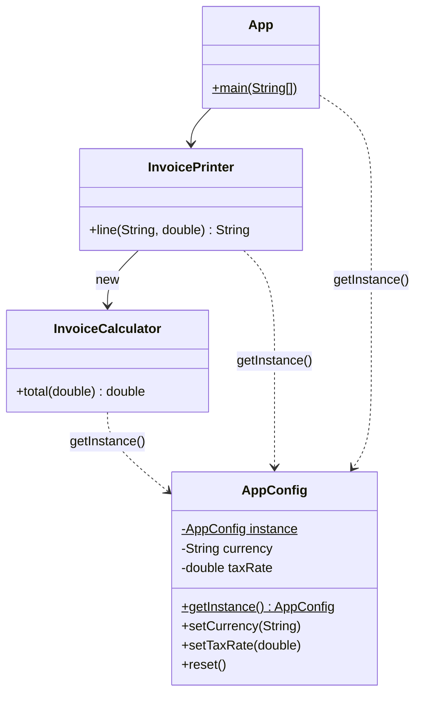
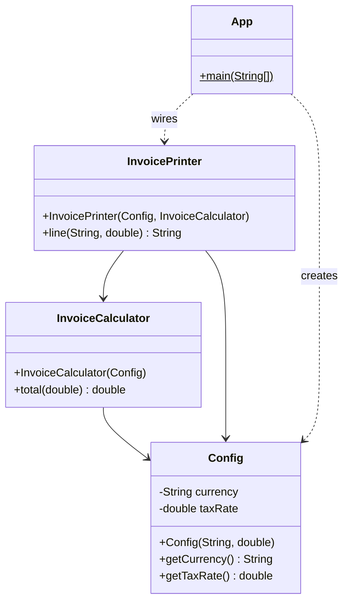

# Singleton Abuse — AppConfig

**Week 12 · Anti-pattern**

## Intent
Singleton abuse means using a Singleton as a convenient *global mutable variable*. Classes reach for `getInstance()` deep inside their methods instead of receiving what they need. This hides dependencies and couples everything to one shared state. Tests interfere with each other because the state outlives each test.

## The problem (`main`)
- `AppConfig.getInstance()` holds a mutable `currency` and `taxRate`, and anyone can call the setters.
- `InvoiceCalculator.total()` and `InvoicePrinter.line()` read the global internally. Their constructors look dependency-free, so the dependency is invisible.
- Only one configuration can exist per JVM. Printing a GEL and a USD invoice side by side is impossible.
- `InvoiceTest` must call `AppConfig.getInstance().reset()` before every test. `reset()` exists in production code only to make tests possible.
- `LeakyInvoiceTest` (`@Tag("problem-demo")`) leaves out the reset: the USD test leaks into the GEL test and it fails.

## The solution (`solution/antipattern-singleton-abuse`)
- `Config` is an immutable value object with no `getInstance()`, setters or `reset()`.
- `InvoiceCalculator(Config)` and `InvoicePrinter(Config, InvoiceCalculator)` receive their dependencies through constructors (Dependency Inversion / Dependency Injection).
- `App.main` is the composition root. It is the only place that creates the `Config` and wires the objects.
- Each test builds its own `Config`, so there is no shared state, tests work in any order, and two configs can coexist.

## Before

## After

## Compare
[problem/antipattern-singleton-abuse...solution/antipattern-singleton-abuse](https://github.com/vamekh/ug-design-patterns-2025/compare/problem/antipattern-singleton-abuse...solution/antipattern-singleton-abuse)

## Discussion
- A Singleton is fine when there truly must be one instance *and* it holds no mutable state that callers depend on, for example a stateless logger or a hardware handle. Even then, prefer injecting it.
- Warning signs: setters on the singleton, a `reset()` that exists only for tests, `getInstance()` called inside business logic, and tests that pass alone but fail together.
- Cost of the fix: more constructor parameters and wiring at the composition root. In large apps a DI container (Spring, Guice) does the wiring.
- Related: Dependency Inversion Principle, Singleton (week 3), Factory (to build object graphs at the root).
