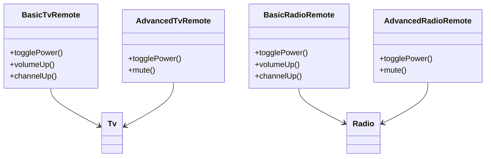
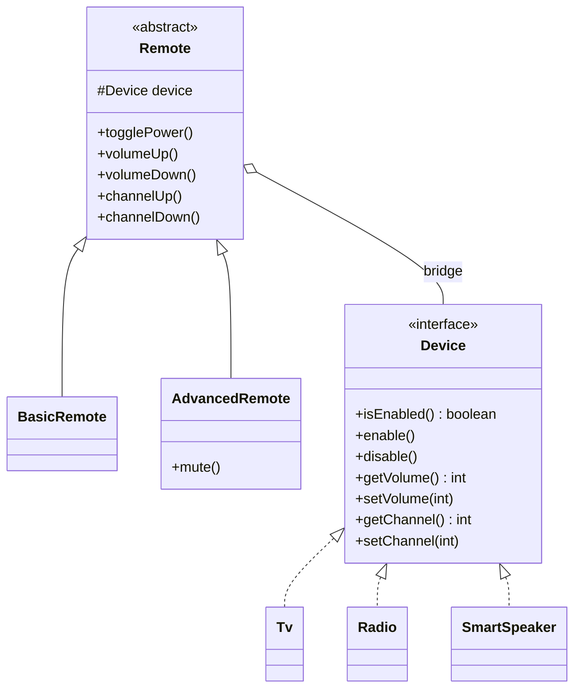

# Bridge — RemoteDevice

**Week 5 · Structural**

## Intent
Decouple an abstraction from its implementation so the two can vary independently, connecting them by composition instead of inheritance.

## The problem (`main`)
- Four classes `BasicTvRemote`, `BasicRadioRemote`, `AdvancedTvRemote`, `AdvancedRadioRemote` – one per (remote kind × device).
- `togglePower`, `volumeUp/Down`, `channelUp/Down` are copy-pasted into all four; `mute` into both advanced ones.
- `Tv` and `Radio` have the same methods but no common type, so a remote cannot accept "any device".
- Adding a `SmartSpeaker` means 2 new remote classes; adding a third remote kind means one per device (n × m growth).

## The solution (`solution/bridge-remote-device`)
- `Remote` (Abstraction) holds a `Device` reference – the bridge – and implements the common controls once.
- `BasicRemote` and `AdvancedRemote` (Refined Abstractions) add features such as `mute()`.
- `Device` (Implementor) is the interface the remotes talk to.
- `Tv`, `Radio`, `SmartSpeaker` (Concrete Implementors) – a new device is one class, a new remote is one class (n + m).

## Before

## After

## Compare
[problem/bridge-remote-device...solution/bridge-remote-device](https://github.com/vamekh/ug-design-patterns-2025/compare/problem/bridge-remote-device...solution/bridge-remote-device)

## Discussion
- Use it when a class hierarchy grows in two independent directions (what it does × how/where it does it), e.g. shapes × renderers, UI × platforms.
- Cost: an extra interface and indirection; overkill if there is only one implementation.
- Related: Adapter makes existing incompatible classes work together after the fact, Bridge is designed up front; Strategy also uses composition but swaps one algorithm, not a whole implementation side.
