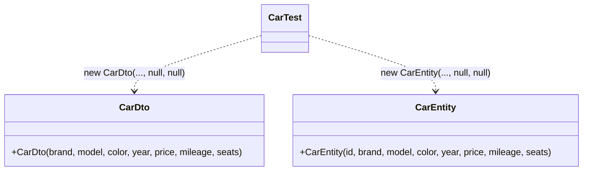
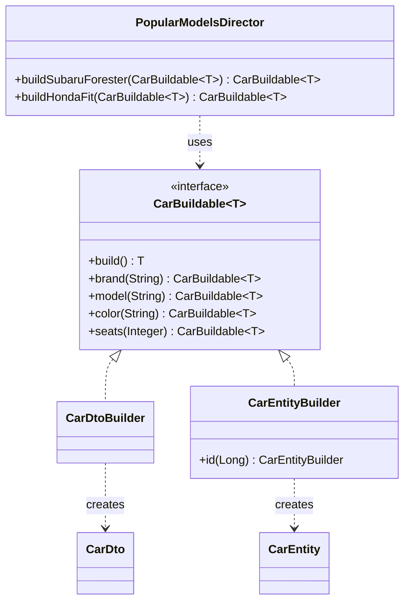

# Builder — Car

**Week 3 · Creational**

## Intent
Separate the construction of a complex object from its representation, so the same construction steps can create different representations.

## The problem (`main`)
- `CarDto` takes 7 and `CarEntity` takes 8 positional constructor arguments, most of them optional.
- Callers pass `null` for unknown values: `new CarDto("Honda", "Fit", null, 2014, null, null, null)`.
- `year`, `price`, `mileage` and `seats` are all `Integer`, so swapping two of them still compiles.
- The "popular model" presets (Subaru Forester, Honda Fit) are copy-pasted for both `CarDto` and `CarEntity` in `CarTest`.

## The solution (`solution/builder-car`)
- `CarBuildable<T>` (Builder interface) declares the named steps; every step returns `CarBuildable<T>` and `build()` returns `T`.
- `CarDtoBuilder` and `CarEntityBuilder` (Concrete Builders) build a `CarDto` and a `CarEntity`; `CarEntityBuilder` adds the `id` step.
- `PopularModelsDirector` (Director) defines each preset once as a generic method `<T> CarBuildable<T> buildSubaruForester(CarBuildable<T>)`, so the same preset works for any product.
- `CarDto` and `CarEntity` (Products) are immutable and their constructors are package-private.

## Before

## After

## Compare
[problem/builder-car...solution/builder-car](https://github.com/vamekh/ug-design-patterns-2025/compare/problem/builder-car...solution/builder-car)

## Discussion
- This is the GoF form of Builder: one Director, several Concrete Builders, different products from the same steps.
- Generics keep it type-safe: `director.buildSubaruForester(new CarEntityBuilder()).build()` returns a `CarEntity`, no casts. With a raw `CarBuildable` the result would be `Object`.
- Cost: the builders repeat the product fields. Libraries such as Lombok `@Builder` generate this code.
- Related: Abstract Factory (families of products), Template Method (fixed sequence of steps).
