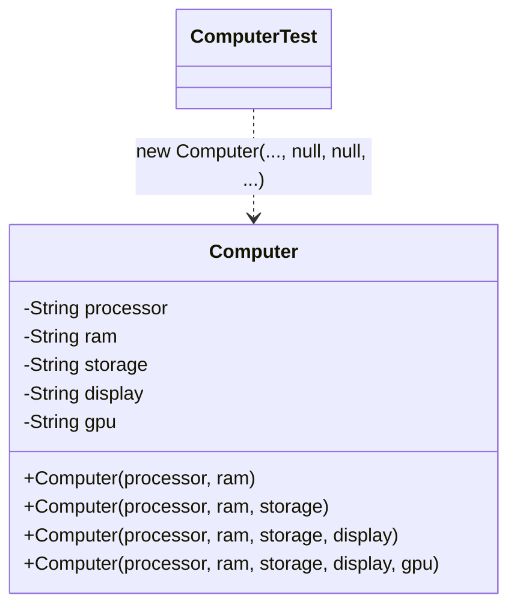
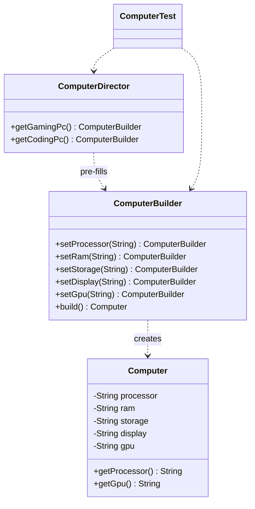

# Builder — Computer

**Week 3 · Creational**

## Intent
Separate the step-by-step construction of a complex object from its representation, so the same construction process can produce different configurations.

## The problem (`main`)
- `Computer` has telescoping constructors (2, 3, 4 and 5 arguments); each new optional part adds another one.
- Callers pass `null` for skipped parts: `new Computer("Intel Core i7", "32GB", null, null, "RTX 4070")`. It is easy to swap two `String` arguments.
- The "gaming" and "coding" presets are copy-pasted in every caller (`ComputerTest`); changing a preset means editing every copy.
- Nothing validates required parts: `new Computer(null, null)` is accepted.

## The solution (`solution/builder-computer`)
- `Computer` (Product) is immutable, with a single package-private constructor.
- `ComputerBuilder` (Builder) sets each part by name (`setProcessor`, `setGpu`, ...) and returns `this` for chaining. `build()` rejects a computer without processor or ram.
- `ComputerDirector` (Director) holds the preset steps (`getGamingPc`, `getCodingPc`) and returns a pre-filled builder that the caller can still customise (e.g. `.setDisplay("4K")`).

## Before

## After

## Compare
[problem/builder-computer...solution/builder-computer](https://github.com/vamekh/ug-design-patterns-2025/compare/problem/builder-computer...solution/builder-computer)

## Discussion
- Use Builder when an object has many optional parts or when construction needs validation before the object exists.
- Cost: one more class that duplicates the product's fields. For 2–3 fields a plain constructor is simpler.
- The Director is optional; it pays off when the same configurations are built in many places.
- Related: Abstract Factory builds families of objects in one call, Builder builds one complex object step by step.
