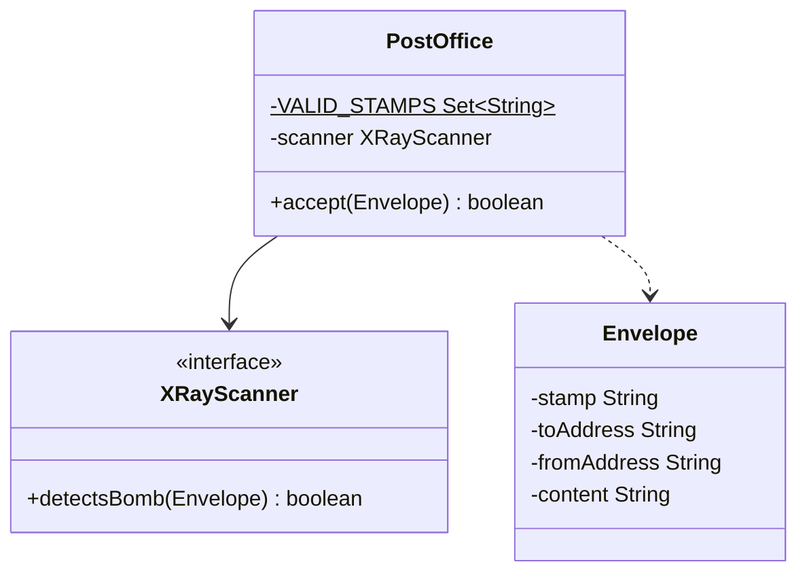
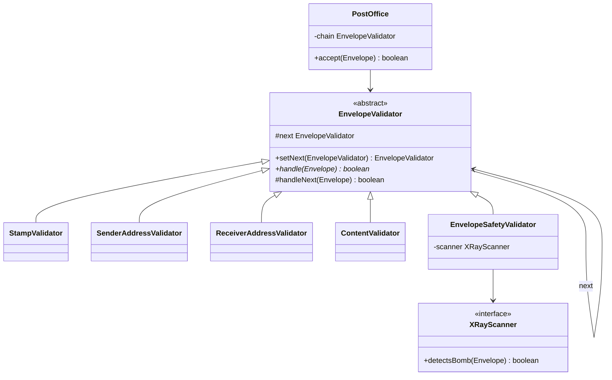

# Chain of Responsibility — Mail

**Week 6 · Behavioral**

## Intent
Pass a request along a chain of handlers. Each handler either deals with the request (here, rejects the envelope) or passes it to the next one, so the sender does not need to know which handler will act.

## The problem (`main`)
- `PostOffice.accept()` runs five validations in one long `if` sequence: stamp, sender, receiver, content and X-ray scan.
- Adding, removing or reordering a check means editing `accept()`.
- No check can be reused on its own. A courier service that only needs the address checks would have to copy them.
- The scanner is random, so it is injected as `XRayScanner`, which keeps the tests deterministic.

## The solution (`solution/chain-of-responsibility-mail`)
- `EnvelopeValidator` (handler) holds the `next` link. `handleNext()` forwards the envelope or accepts it when the chain ends.
- `StampValidator`, `SenderAddressValidator`, `ReceiverAddressValidator`, `ContentValidator` and `EnvelopeSafetyValidator` (concrete handlers) each contain one rule.
- `PostOffice` (client) builds the chain in its constructor, and `accept()` only calls the first link.
- Every validator moves on through `handleNext()`, so any of them can be the last link without causing a `NullPointerException`.
- `EnvelopeSafetyValidator` receives the `XRayScanner` through its constructor. A `RootRing` placeholder head is not needed.

## Before

## After

## Compare
[problem/chain-of-responsibility-mail...solution/chain-of-responsibility-mail](https://github.com/vamekh/ug-design-patterns-2025/compare/problem/chain-of-responsibility-mail...solution/chain-of-responsibility-mail)

## Discussion
- Use it for validation pipelines where the checks are independent and their set or order changes, for example HTTP filters or middleware.
- Put cheap checks first: a fake stamp is rejected before the expensive X-ray scan runs.
- Cost: the order of the chain is configured in code (`PostOffice`), and a missing `handleNext()` call silently cuts the chain short.
- Related: Decorator has a similar structure, but no link stops the chain. Command objects are often the requests passed along a chain.
