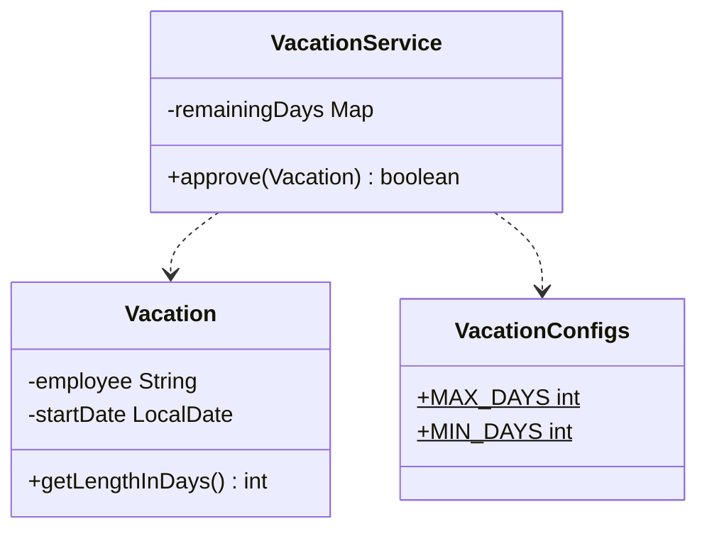
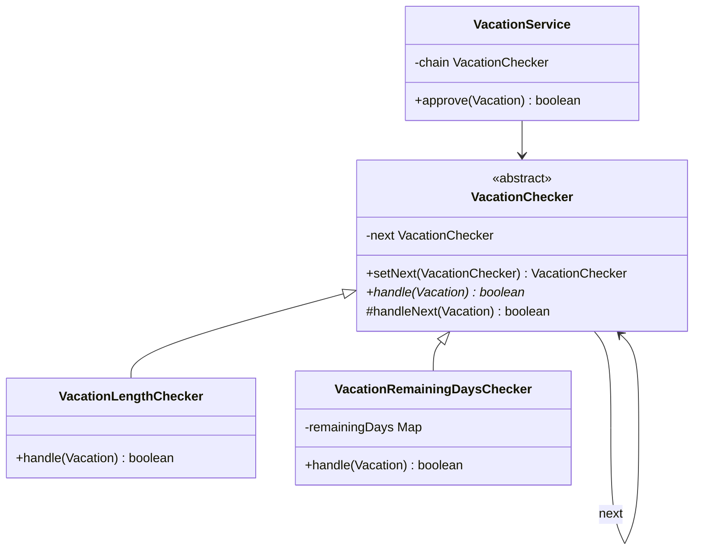

# Chain of Responsibility — Vacation

**Week 6 · Behavioral**

## Intent
Pass a request along a chain of handlers. Each handler either deals with the request (here, rejects it) or passes it to the next one, so the sender does not need to know which handler will act.

## The problem (`main`)
- `VacationService.approve()` checks the length limits and the remaining days in one nested `if/else`.
- Adding a rule (manager approval, blocked months...) means editing `approve()` again and nesting it deeper.
- The checks cannot be reordered, reused elsewhere or tested on their own.

## The solution (`solution/chain-of-responsibility-vacation`)
- `VacationChecker` (handler) holds the `next` link. `handleNext()` forwards the request or approves it when the chain ends.
- `VacationLengthChecker` and `VacationRemainingDaysChecker` (concrete handlers) each contain exactly one rule.
- `VacationRemainingDaysChecker` receives the remaining days through its constructor. The old static mutable map was shared across tests.
- `VacationService` (client) builds the chain once, and `approve()` delegates to its first handler.
- A new rule is a new subclass inserted with `setNext()`. The tests add a "no August vacations" rule this way.

## Before

## After

## Compare
[problem/chain-of-responsibility-vacation...solution/chain-of-responsibility-vacation](https://github.com/vamekh/ug-design-patterns-2025/compare/problem/chain-of-responsibility-vacation...solution/chain-of-responsibility-vacation)

## Discussion
- Use it when a request goes through a sequence of independent checks or handlers, and that sequence should be configurable.
- In this variant every handler may stop the chain, which works like a validation pipeline. In the classic GoF variant, the first handler that can deal with the request handles it.
- Costs: there is no guarantee that anything handles the request, so decide what the end of the chain means. A long chain is harder to debug.
- Related: Decorator also chains objects, but every link adds behaviour and none stops the chain. Servlet filters and middleware use the same idea.
