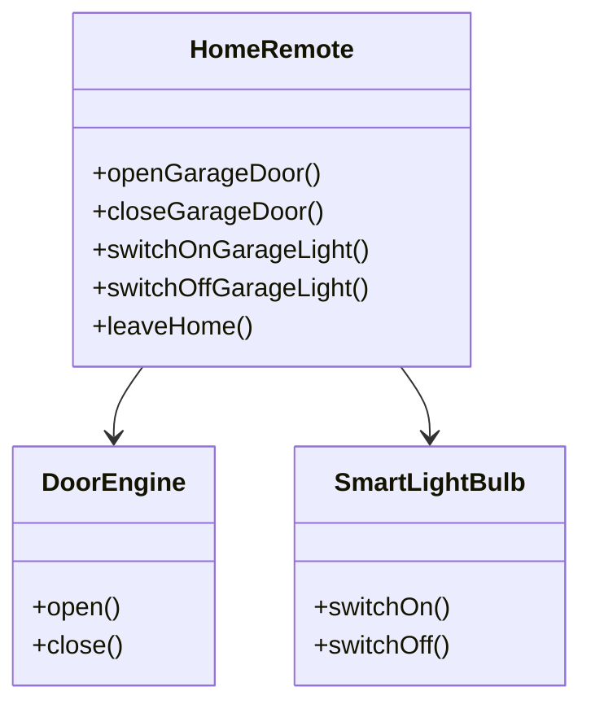
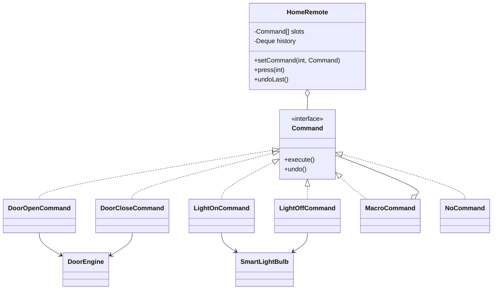

# Command — Home Remote

**Week 7 · Behavioral**

## Intent
Encapsulate a request as an object, so that invokers can be configured with different requests,
requests can be queued or combined, and actions can be undone.

## The problem (`main`)
- `HomeRemote` holds a `DoorEngine` and a `SmartLightBulb` and calls them directly.
- Every button is a hard-coded method (`openGarageDoor`, `switchOnGarageLight`, `leaveHome`, ...).
- Adding a device or re-assigning a button means editing and recompiling `HomeRemote`.
- There is no undo: the caller has to remember what was pressed and call the opposite method.

## The solution (`solution/command-homeremote`)
- `Command` (command) declares `execute()` and `undo()`.
- `DoorOpenCommand`, `DoorCloseCommand`, `LightOnCommand`, `LightOffCommand` (concrete commands) wrap one receiver call and its inverse.
- `DoorEngine`, `SmartLightBulb` (receivers) are unchanged devices.
- `HomeRemote` (invoker) has numbered slots, `setCommand(slot, cmd)`, `press(slot)` and `undoLast()` backed by a history stack.
- `MacroCommand` groups commands ("leaving home") and undoes them in reverse; `NoCommand` (null object) fills empty slots.

## Before

## After

## Compare
[problem/command-homeremote...solution/command-homeremote](https://github.com/vamekh/ug-design-patterns-2025/compare/problem/command-homeremote...solution/command-homeremote)

## Discussion
- Use it for configurable buttons/menus, undo/redo, job queues, transactions and macro recording.
- Cost: one small class per action; undo needs each command to know how to reverse itself (or a Memento).
- In modern Java a command without undo is often just a `Runnable` lambda.
- Related: Composite (`MacroCommand`), Memento (state for undo), Null Object (`NoCommand`), Strategy.
