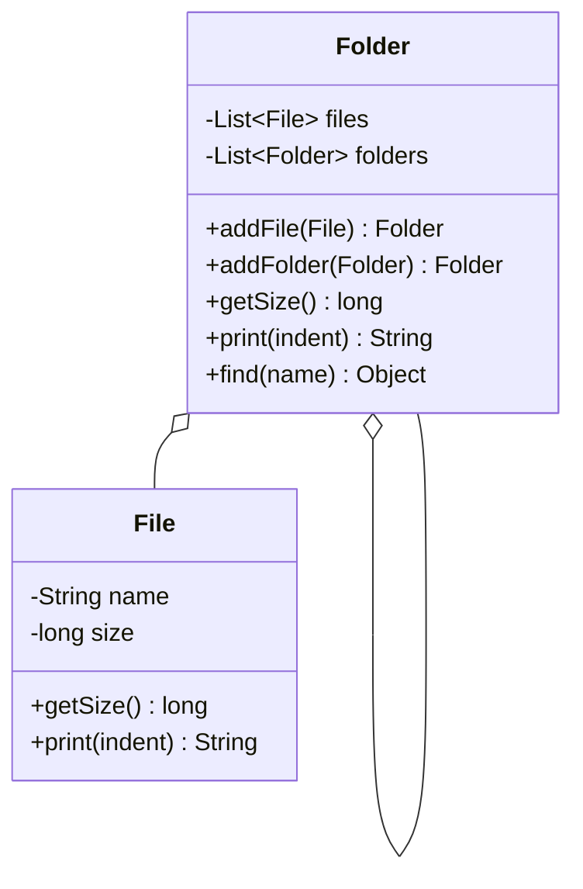
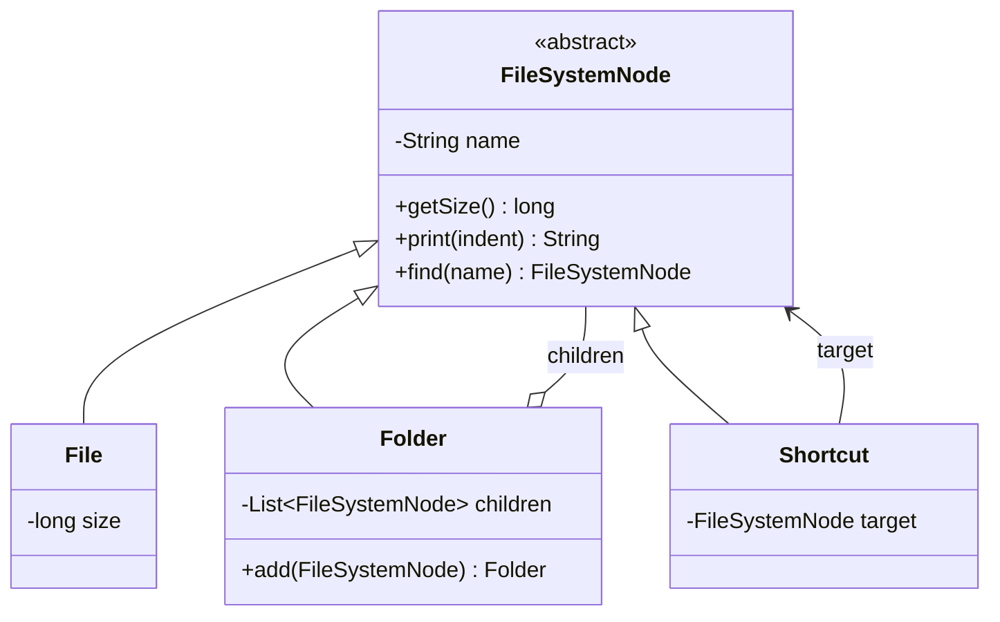

# Composite — FileSystem

**Week 5 · Structural**

## Intent
Compose objects into tree structures and let clients treat single objects (files) and compositions (folders) the same way.

## The problem (`main`)
- `Folder` keeps two lists, `List<File>` and `List<Folder>`.
- `getSize()`, `print()` and `find()` each loop twice and special-case each type.
- `find()` returns `Object`, so the client needs `instanceof` to use the result.
- Adding a new entry type (a `Shortcut`) means editing `Folder`: a new list, a new `addX` method, a new loop in every operation.

## The solution (`solution/composite-filesystem`)
- `FileSystemNode` (Component) declares `getSize()`, `print(indent)` and `find(name)`.
- `File` (Leaf) returns its own size and line.
- `Folder` (Composite) holds one `List<FileSystemNode>` and delegates to its children.
- `Shortcut` (Leaf) is a new node type added without touching `Folder`.

## Before

## After

## Compare
[problem/composite-filesystem...solution/composite-filesystem](https://github.com/vamekh/ug-design-patterns-2025/compare/problem/composite-filesystem...solution/composite-filesystem)

## Discussion
- Use it whenever the data is naturally a tree (folders, menus, UI widgets, org charts) and clients should not care about leaf vs container.
- Trade-off: the component interface is shared, so it is harder to restrict which children a composite may hold (e.g. "no folders inside a zip").
- Related: Iterator (walking the tree), Visitor (new operations over the tree without editing nodes), Decorator (also a recursive wrapper, but with one child).
