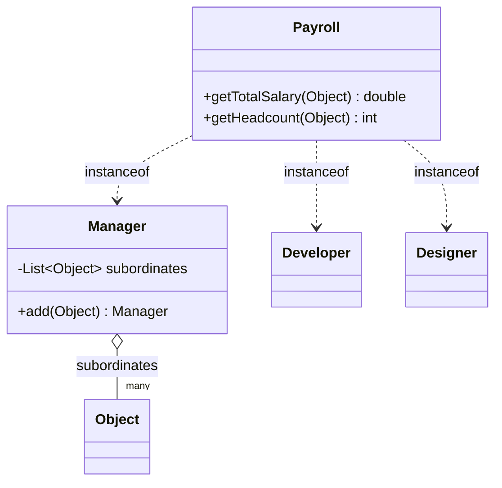
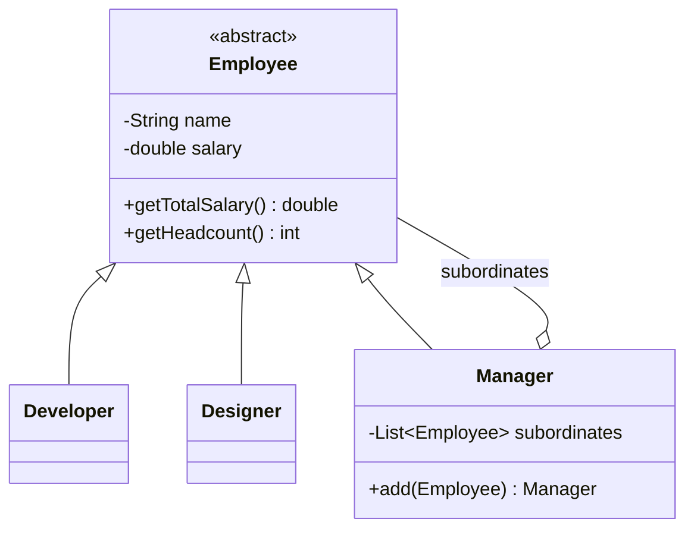

# Composite — OrgChart

**Week 5 · Structural**

## Intent
Represent a part-whole hierarchy (a manager and everyone below them) so that a single employee and a whole team answer the same questions.

## The problem (`main`)
- `Manager`, `Developer` and `Designer` have no common type; `Manager` stores its team as `List<Object>`.
- `Payroll.getTotalSalary()` and `Payroll.getHeadcount()` walk the tree with `instanceof` chains.
- Adding a role (e.g. `Tester`) means editing every method in `Payroll`.
- A forgotten branch or a wrong object (`add("not an employee")`) is silently counted as 0.

## The solution (`solution/composite-orgchart`)
- `Employee` (Component) declares `getTotalSalary()` and `getHeadcount()`.
- `Developer`, `Designer` (Leaves) return their own salary and a headcount of 1.
- `Manager` (Composite) adds its own salary to the sum of its `List<Employee>` subordinates.
- `Payroll` is no longer needed: any node, leaf or subtree, answers for itself.

## Before

## After

## Compare
[problem/composite-orgchart...solution/composite-orgchart](https://github.com/vamekh/ug-design-patterns-2025/compare/problem/composite-orgchart...solution/composite-orgchart)

## Discussion
- Same pattern as the file-system example: whenever you see `instanceof` used to recurse through a tree, a Composite is usually missing.
- Trade-off: new *operations* (e.g. "average salary per level") still need a method on every class; Visitor helps when operations change more often than node types.
- Related: Iterator for walking the hierarchy, Chain of Responsibility often follows the parent/manager links upward.
