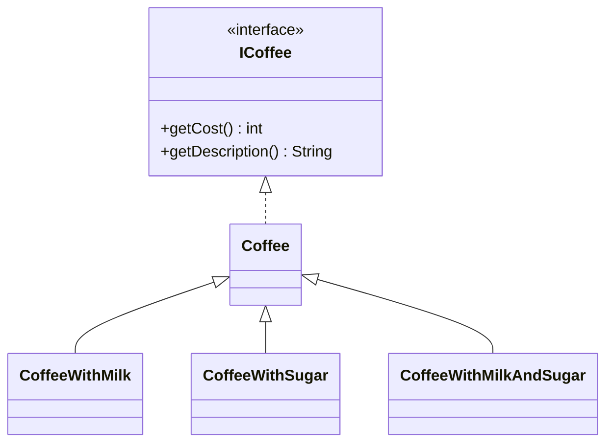
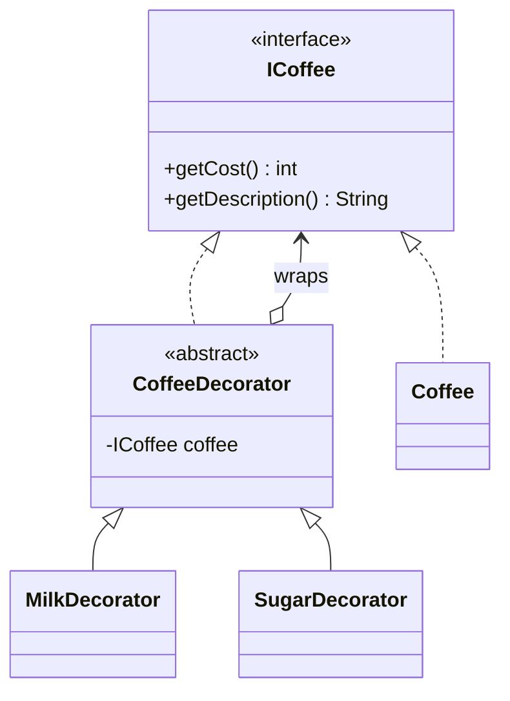

# Decorator — Coffee

**Week 4 · Structural**

## Intent
Attach extra responsibilities to an object dynamically by wrapping it in objects with the same interface, instead of creating a subclass for every combination.

## The problem (`main`)
- `CoffeeWithMilk`, `CoffeeWithSugar`, `CoffeeWithMilkAndSugar` are one subclass per combination of add-ons.
- The price of milk (`100`) and sugar (`50`) is copy-pasted into several classes.
- "Double milk" or a new add-on (syrup) needs yet more classes: the count grows combinatorially.
- The combination is fixed at compile time; the customer cannot build an order at runtime.

## The solution (`solution/decorator-coffee`)
- `ICoffee` is the Component interface; `Coffee` is the Concrete Component.
- `CoffeeDecorator` is the base Decorator: it holds an `ICoffee` and forwards to it.
- `MilkDecorator` and `SugarDecorator` are Concrete Decorators: each adds its own cost and description once.
- Orders are composed by wrapping: `new SugarDecorator(new MilkDecorator(new Coffee()))`; double milk is just two `MilkDecorator`s.

## Before

## After

## Compare
[problem/decorator-coffee...solution/decorator-coffee](https://github.com/vamekh/ug-design-patterns-2025/compare/problem/decorator-coffee...solution/decorator-coffee)

## Discussion
- Use it when features combine freely and you would otherwise get a subclass per combination.
- Cost: many small objects; the order of wrapping can matter (description order here), and debugging a deep wrapper chain is harder.
- Related: Composite (same recursive structure, but aggregates many children), Proxy (same interface, controls access instead of adding behaviour), Strategy (changes the guts instead of the skin).
