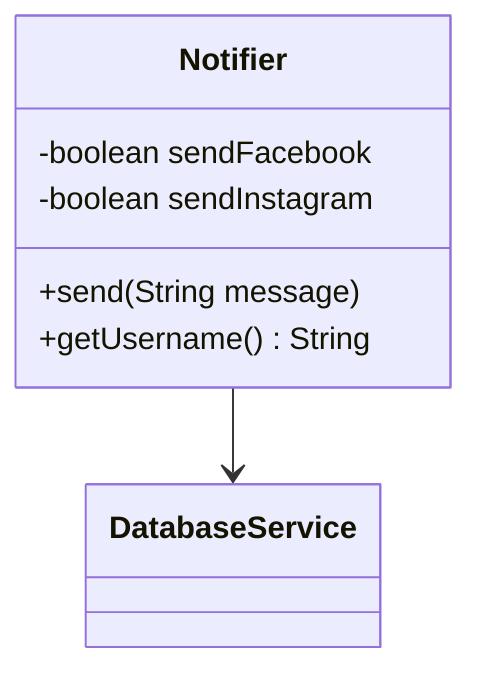
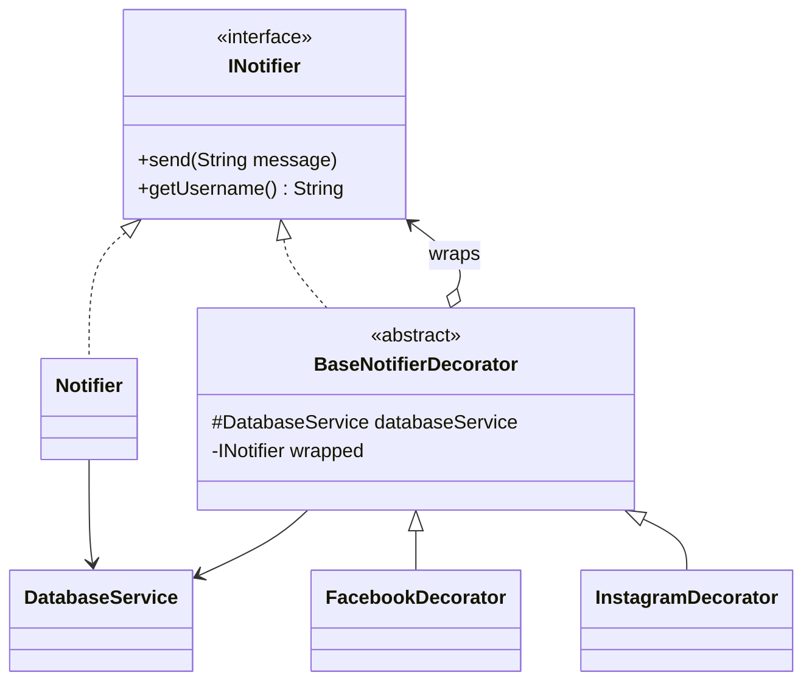

# Decorator — Notifier

**Week 4 · Structural**

## Intent
Add behaviour to an object at runtime by wrapping it in decorators that share its interface, so features can be combined without flags or subclasses.

## The problem (`main`)
- `Notifier` takes `sendFacebook` and `sendInstagram` booleans and `send()` has an `if` per channel.
- Adding SMS or Slack means editing `Notifier`: a new field, a new constructor parameter and a new branch.
- Callers write `new Notifier("x", true, false)`, which does not say what is sent where.
- All channel logic lives in one class that keeps growing.

## The solution (`solution/decorator-notifier`)
- `INotifier` is the Component; `Notifier` is the Concrete Component and only sends e-mail.
- `BaseNotifierDecorator` holds the wrapped `INotifier`, forwards `send()`/`getUsername()` and owns the `DatabaseService`.
- `FacebookDecorator` and `InstagramDecorator` are Concrete Decorators: call `super.send()` then post to their channel.
- A new channel is a new decorator; `Notifier` is never touched again.

## Before

## After

## Compare
[problem/decorator-notifier...solution/decorator-notifier](https://github.com/vamekh/ug-design-patterns-2025/compare/problem/decorator-notifier...solution/decorator-notifier)

## Discussion
- Good fit when optional features stack and the client picks them at runtime.
- Order matters: wrapping order decides sending order; a decorator cannot easily be removed from the middle of a chain.
- Related: Chain of Responsibility (similar chain, but a handler may stop the request), Composite, Strategy.
