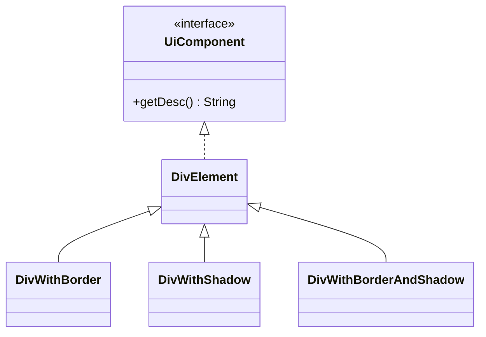
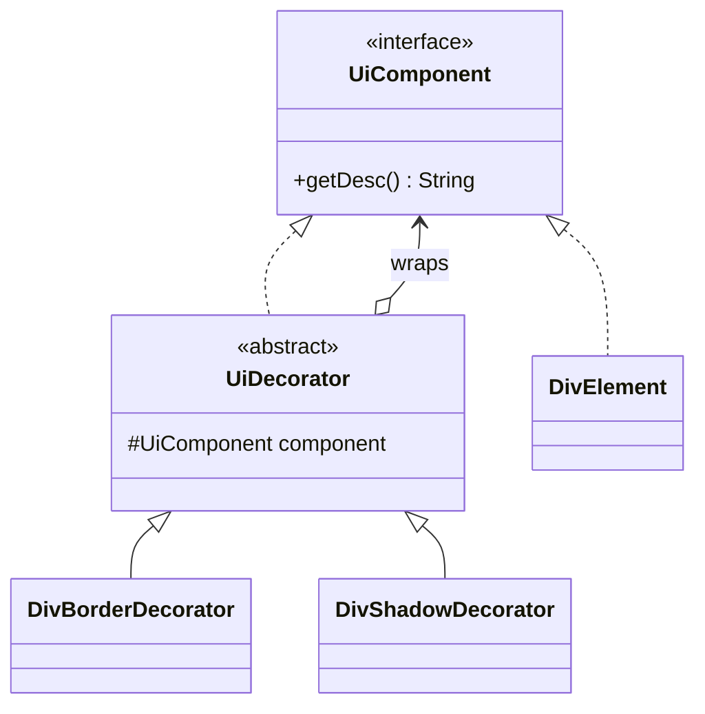

# Decorator — UiComponent

**Week 4 · Structural**

## Intent
Wrap a UI component in decorators that add visual extras (border, shadow) while keeping the same `UiComponent` interface, instead of subclassing for every look.

## The problem (`main`)
- `DivWithBorder`, `DivWithShadow` and `DivWithBorderAndShadow` all extend `DivElement`.
- The border and shadow text is copy-pasted into several classes.
- A third extra (rounded corners) would need four more classes to cover all combinations.
- The look is fixed by the class at compile time; a shadow cannot be added on hover.

## The solution (`solution/decorator-uicomponent`)
- `UiComponent` is the Component, `DivElement` the Concrete Component.
- `UiDecorator` is the base Decorator holding the wrapped `UiComponent`.
- `DivBorderDecorator` and `DivShadowDecorator` are Concrete Decorators that append their part to `component.getDesc()`.
- Any combination is `new DivShadowDecorator(new DivBorderDecorator(new DivElement()))`.

## Before

## After

## Compare
[problem/decorator-uicomponent...solution/decorator-uicomponent](https://github.com/vamekh/ug-design-patterns-2025/compare/problem/decorator-uicomponent...solution/decorator-uicomponent)

## Discussion
- Classic use: GUI toolkits (scroll bars, borders) and Java I/O streams (`BufferedInputStream(new FileInputStream(...))`).
- Cost: object identity changes with every wrap, and many tiny classes can be harder to navigate.
- Related: Composite (tree of components), Strategy (change internals instead of wrapping).
