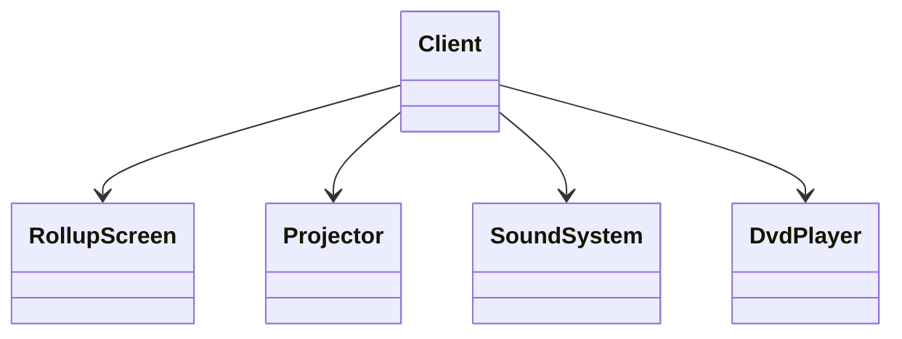
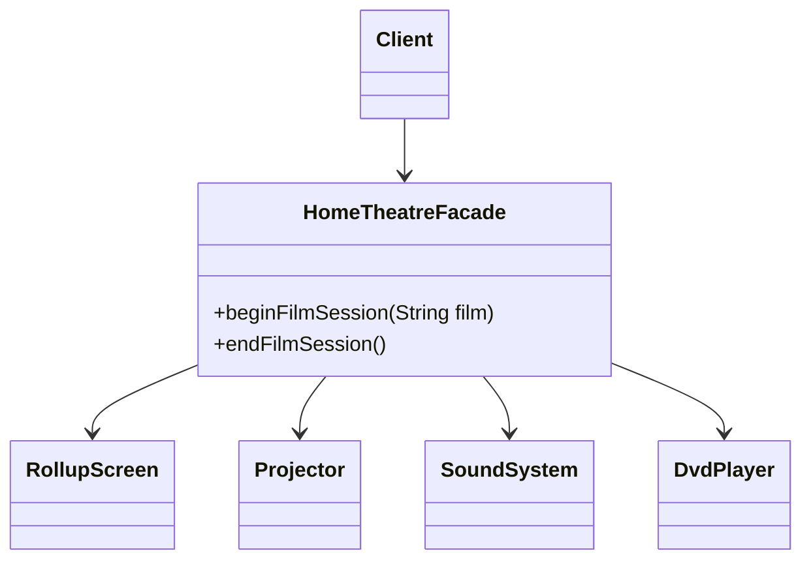

# Facade — HomeTheatre

**Week 4 · Structural**

## Intent
Provide one simple interface to a set of interfaces in a subsystem, so clients do not have to know its parts or the order in which to use them.

## The problem (`main`)
- To watch a film the client talks to `RollupScreen`, `Projector`, `SoundSystem` and `DvdPlayer` directly.
- Seven calls in a fixed order to start and four in reverse to stop; get one wrong and the film does not show.
- Every client that wants a film night repeats the same sequence.
- Adding a device (popcorn machine, lights) means updating every client.

## The solution (`solution/facade-hometheatre`)
- `HomeTheatreFacade` is the Facade: `beginFilmSession(film)` and `endFilmSession()`.
- The four device classes are the Subsystem; they are unchanged and still usable directly.
- The facade owns the order of calls and prints the title banner (now safe for long titles).

## Before

## After

## Compare
[problem/facade-hometheatre...solution/facade-hometheatre](https://github.com/vamekh/ug-design-patterns-2025/compare/problem/facade-hometheatre...solution/facade-hometheatre)

## Discussion
- Use it to give a simple default path through a complex subsystem; power users can still use the parts directly.
- Risk: the facade can grow into a "god object" coupled to everything; keep it to orchestration.
- Related: Adapter (converts one interface, Facade defines a new simpler one), Mediator (subsystem parts talk through it, unlike a Facade they are unaware of), Least Knowledge principle.
