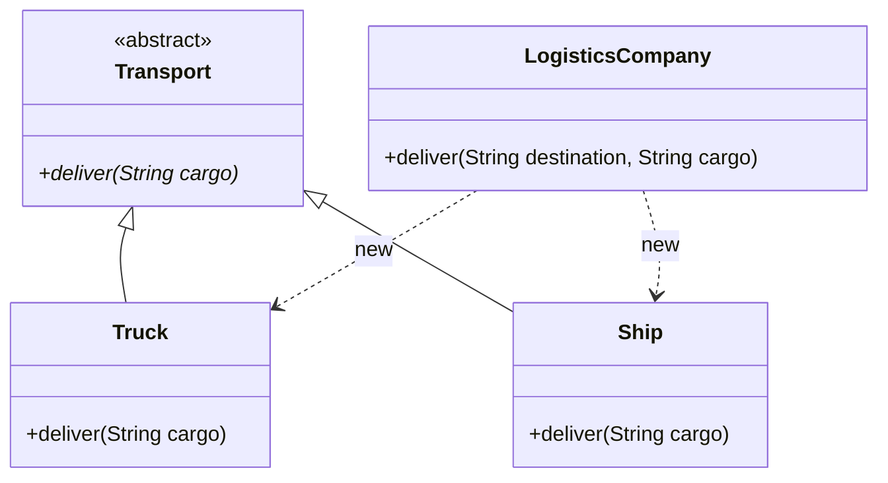
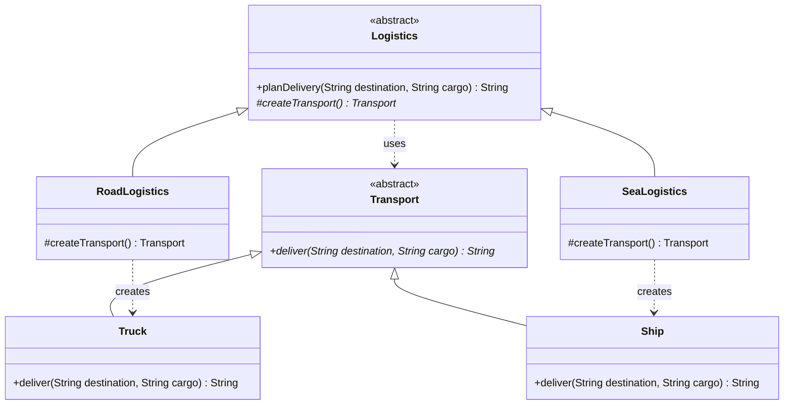

# Factory Method — Logistics

**Week 2 · Creational**

## Intent
Define an interface for creating an object, but let implementations (subclasses) decide which class to instantiate. Factory Method lets a class defer instantiation to its subclasses.

## The problem (`main`)
- `LogisticsCompany.deliver()` picks the transport with `if ("overseas") new Ship() else new Truck()`, so creation is hard-coded inside the business method.
- Adding air freight (`Plane`) means editing `LogisticsCompany`, which breaks the Open/Closed Principle.
- The client is coupled to every concrete `Transport` class.

## The solution (`solution/factory-method-logistics`)
- `Transport` (Product) stays an abstract class; `deliver(destination, cargo)` now returns the delivery report instead of printing it.
- `Truck` and `Ship` are the Concrete Products.
- `Logistics` (Creator) is an abstract class: `planDelivery(destination, cargo)` holds the business logic and calls the factory method `createTransport()`.
- `RoadLogistics` and `SeaLogistics` (Concrete Creators) override only `createTransport()`, each returning its own transport.
- The client picks a `Logistics` once and calls `planDelivery()`. A new mode is a new creator plus a new product, and no existing class changes.

## Before

## After

## Compare
[problem/factory-method-logistics...solution/factory-method-logistics](https://github.com/vamekh/ug-design-patterns-2025/compare/problem/factory-method-logistics...solution/factory-method-logistics)

## Discussion
- This is the classic GoF form: the Creator is an abstract class whose business method (`planDelivery()`) calls the factory method, so the delivery steps are written once and only the product varies.
- Choosing *which* creator to use still happens somewhere, typically once at start-up or in configuration.
- Cost: one creator class per product. When creators do nothing but `return new X()`, a Simple Factory or a constructor reference (`Supplier<Transport>`) may be enough.
- Related: Simple Factory, Abstract Factory (a factory method per product in a family), Template Method (factory methods are often called from template methods).
