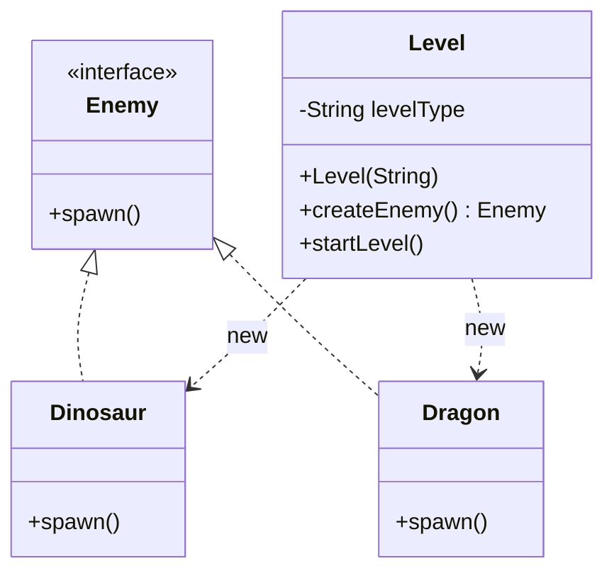
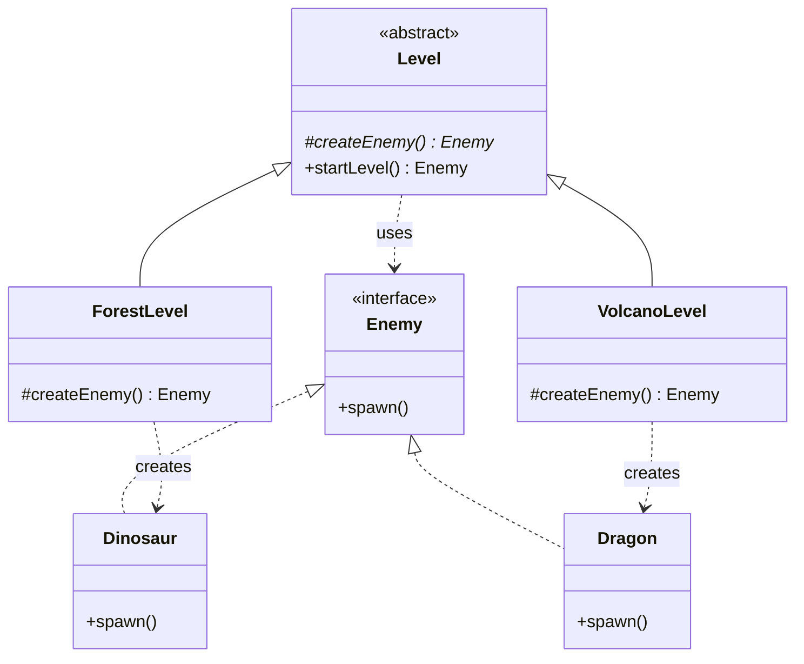

# Factory Method — Video Game

**Week 2 · Creational**

## Intent
Define an interface for creating an object, but let subclasses decide which class to instantiate. The base class keeps the shared algorithm, and each subclass supplies the product it needs.

## The problem (`main`)
- `Level` takes a `levelType` string, and `createEnemy()` switches on it: `"Forest"` gives `Dinosaur`, `"Volcano"` gives `Dragon`.
- Every new level or enemy means editing the `switch` in `Level` (an Open/Closed violation), and a typo in the string fails only at runtime.
- `Level` is coupled to every concrete `Enemy`.

## The solution (`solution/factory-method-videogame`)
- `Level` (Abstract Creator) becomes abstract. `startLevel()` keeps the shared flow, calls the factory method `createEnemy()` and returns the spawned enemy.
- `ForestLevel` and `VolcanoLevel` (Concrete Creators) override `createEnemy()` to return `Dinosaur` and `Dragon`.
- `Enemy` (Product) and `Dinosaur`/`Dragon` (Concrete Products) are unchanged apart from role comments.
- A new level is a new subclass. `Level` is never edited.

## Before

## After

## Compare
[problem/factory-method-videogame...solution/factory-method-videogame](https://github.com/vamekh/ug-design-patterns-2025/compare/problem/factory-method-videogame...solution/factory-method-videogame)

## Discussion
- This is the textbook shape: the Creator contains real logic (`startLevel()`) and leaves only the "which object?" decision to subclasses.
- `startLevel()` combined with `createEnemy()` is also a tiny Template Method. The two patterns often appear together.
- Cost: one subclass per product variant. If levels differ in several products (enemy, terrain, music), Abstract Factory fits better.
- Related: Template Method, Abstract Factory, Prototype (clone a configured enemy instead of subclassing).
