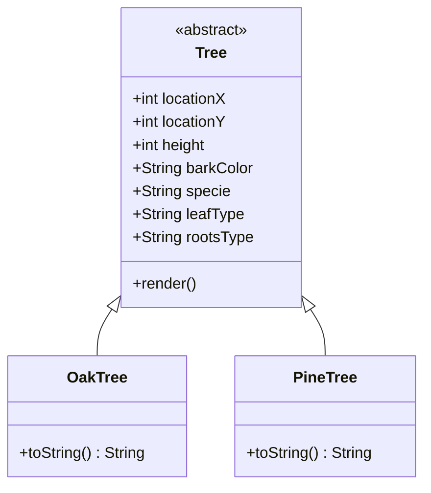
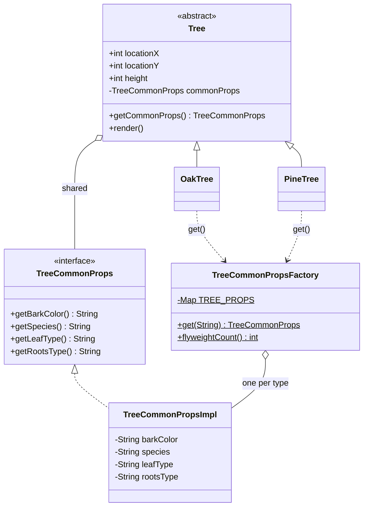

# Flyweight — Forest Game

**Week 5 · Structural**

## Intent
Use sharing to support large numbers of fine-grained objects efficiently. Split each object's state into *intrinsic* state, which is the same for many objects and is shared, and *extrinsic* state, which is unique per object and kept outside the shared part.

## The problem (`main`)
- Every `Tree` stores its own copy of `barkColor`, `specie`, `leafType` and `rootsType`, even though these are identical for all oaks and for all pines.
- The test plants 10,000 trees, so the same four strings are referenced 10,000 times instead of twice. With real assets (textures, meshes) that becomes a memory problem.
- `OakTree`/`PineTree` pass the species constants to `super(...)` and then redundantly re-assign the location fields.
- `Tree.render()` calls `printf("... %d\n")` with no argument, so it would throw `MissingFormatArgumentException`.

## The solution (`solution/flyweight-forestgame`)
- `TreeCommonProps` (Flyweight interface) exposes the intrinsic state: `getBarkColor()`, `getSpecies()`, `getLeafType()`, `getRootsType()`. It was renamed from the misspelled `TreeComonProps` in a later fix commit.
- `TreeCommonPropsImpl` (Concrete Flyweight) is package-private and immutable (`private final` fields).
- `TreeCommonPropsFactory` (Flyweight Factory) holds an immutable `Map` with exactly one shared instance per tree type and returns it from `get(treeType)`. An unknown type throws `IllegalArgumentException`; `flyweightCount()` reports how many flyweights exist.
- `Tree` (Context) does **not** implement `TreeCommonProps`. It keeps only the extrinsic state (`locationX`, `locationY`, `height`) plus a reference to the shared props (`getCommonProps()`). `OakTree`/`PineTree` simply ask the factory for their props.
- `render()` combines both: species, bark, leaves and roots from the flyweight, location and height from the tree.
- The test plants 10,000 trees with a seeded `Random` and asserts that they share only `flyweightCount()` props objects (`assertSame` for trees of one type).

## Before

## After

## Compare
[problem/flyweight-forestgame...solution/flyweight-forestgame](https://github.com/vamekh/ug-design-patterns-2025/compare/problem/flyweight-forestgame...solution/flyweight-forestgame)

## Discussion
- Flyweights must be immutable. Shared state that one tree could change would change it for every tree of that type.
- It is worth it only with *many* objects whose shared state is large. For four short strings the JVM's string interning already shares the values, so this example illustrates the structure more than the savings.
- Keeping `Tree` and `TreeCommonProps` separate makes the intrinsic/extrinsic split visible. A variant moves `render(x, y, height)` onto the flyweight itself and passes the extrinsic state in; letting `Tree` implement the flyweight interface would blur that split.
- Related: Factory / Singleton (the flyweight factory), Composite (leaf nodes are often flyweights), `Integer.valueOf()` and the `String` pool in the JDK.
