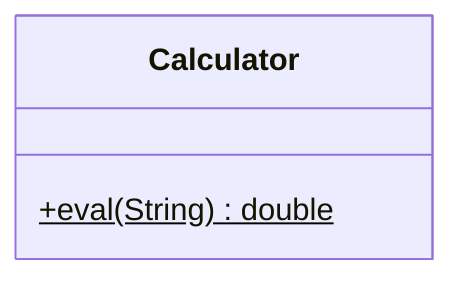
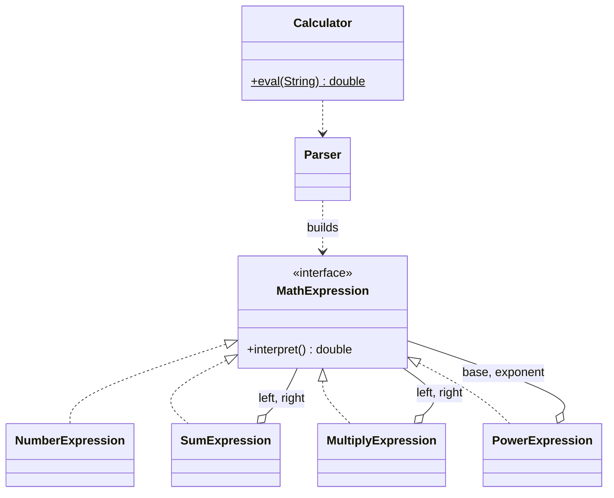

# Interpreter — Math

**Week 10 · Behavioral**

## Intent
Given a language, define a representation for its grammar (one class per rule) along with an interpreter that uses that representation to evaluate sentences in the language.

## The problem (`main`)
- `Calculator.eval("2 + 3 ^ 2")` evaluates by splitting the string on `+`, then `*`, then `^` inside nested `if`s.
- Operator precedence works only because of the order of the `split()` calls. The grammar is never written down.
- Parentheses are rejected (`UnsupportedOperationException`). Supporting them would take another round of string tricks.
- There is no tree, so nothing can be reused, printed, or evaluated twice without parsing again.

## The solution (`solution/interpreter-math`)
- `MathExpression` (Abstract Expression) declares `double interpret()`.
- `NumberExpression` (Terminal Expression) holds a value.
- `SumExpression`, `MultiplyExpression`, `PowerExpression` (Non-terminal Expressions) interpret their children and combine them.
- `Parser` builds the tree by recursive descent, with one method per grammar rule:
  `sum ::= product ("+" product)*`, `product ::= power ("*" power)*`, `power ::= primary ["^" power]`, `primary ::= number | "(" sum ")"`
  This gives the precedence `^` > `*` > `+`, makes `^` right-associative, and supports parentheses.
- `Calculator.eval(String)` keeps its signature and delegates to `Parser` and then `interpret()`.
- Bug fixed: the old `SumExpression(right, left)` constructor had its parameters swapped. It is now `(left, right)`.

## Before

## After

## Compare
[problem/interpreter-math...solution/interpreter-math](https://github.com/vamekh/ug-design-patterns-2025/compare/problem/interpreter-math...solution/interpreter-math)

## Discussion
- Interpreter fits small, stable grammars such as rules, filters, or simple formulas. For large grammars, use a parser generator (ANTLR) instead.
- Parsing is not part of the GoF pattern itself. The pattern starts once the tree exists. `Parser` is shown here so the example is complete.
- Every grammar rule is a class, so a large grammar leads to many classes. To add many *operations* over the tree, use Visitor (see `visitor-expression`).
- Related: Composite (the expression tree is a composite), Visitor.
