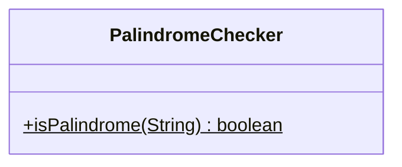
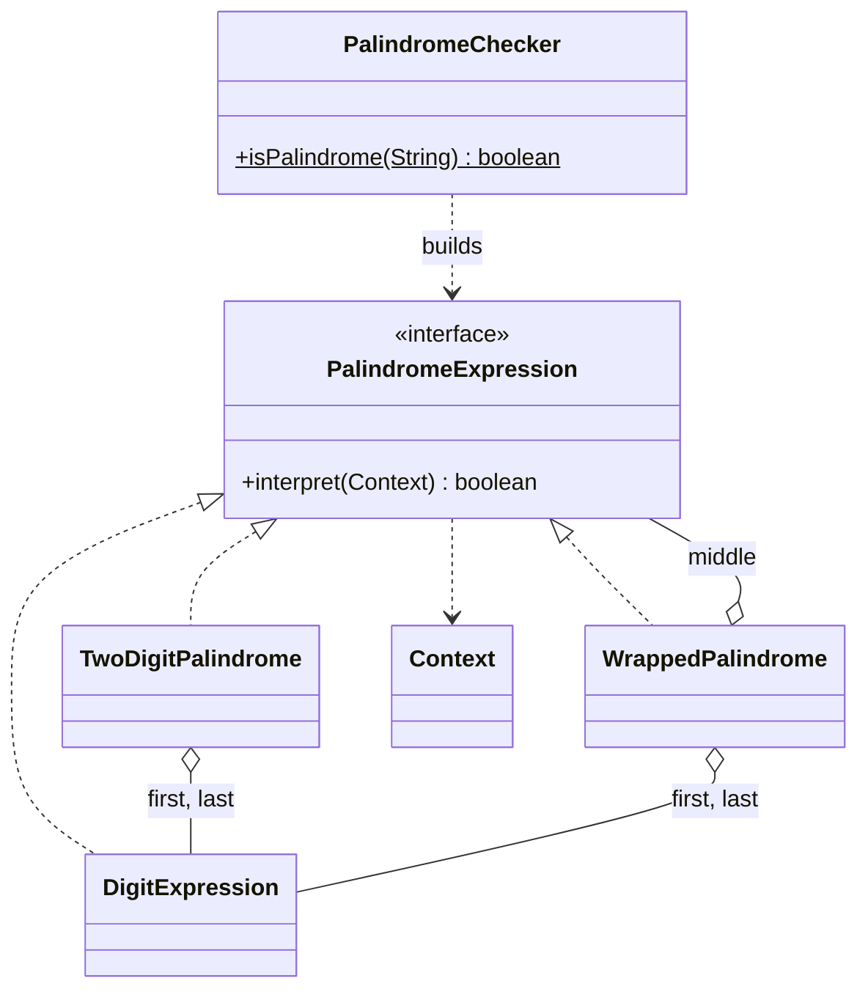

# Interpreter — Palindrome

**Week 10 · Behavioral**

## Intent
Represent each rule of a small grammar as a class and recognise sentences of the language by interpreting the resulting syntax tree.

## Grammar (`src/main/resources/number.bnf`)
```
<palindrom> ::= <digit> | <digit>[1] <palindrom> <digit>[2] | <digit>[1] <digit>[2]
predicate:      digit[1] == digit[2]
<digit>     ::= "0" | "1" | "2" | "3" | "4" | "5" | "6" | "7" | "8" | "9"
```
The original grammar wrote the last alternative as `<digit><digit>` with no predicate, which would accept `12`. For palindromes the two digits must also be equal, so the predicate applies to that alternative as well.

## The problem (`main`)
- `PalindromeChecker.isPalindrome(String)` uses one while-loop with two moving indexes `i` and `j`.
- Checking that a character is a digit and checking the palindrome rule are mixed in the same `if`s.
- The grammar (single digit, two equal digits, digit + palindrome + same digit) is not visible in the code.
- Changing the language (e.g. allowing letters, or a separator in the middle) means rewriting the loop.

## The solution (`solution/interpreter-palindrome`)
- `PalindromeExpression` (Abstract Expression) is `<palindrom>`, with `boolean interpret(Context)`.
- `DigitExpression` (Terminal Expression) is `<digit>`. It checks the character at its position and is also the single-digit `<palindrom>`.
- `TwoDigitPalindrome` (Non-terminal) is `<digit>[1] <digit>[2]` and requires `digit[1] == digit[2]`.
- `WrappedPalindrome` (Non-terminal) is `<digit>[1] <palindrom> <digit>[2]` and requires the predicate plus a valid middle.
- `Context` holds the input string. `PalindromeChecker` (Client) builds the tree for the input length and interprets it.

## Before


## After


## Compare
[problem/interpreter-palindrome...solution/interpreter-palindrome](https://github.com/vamekh/ug-design-patterns-2025/compare/problem/interpreter-palindrome...solution/interpreter-palindrome)

## Discussion
- Each class matches exactly one BNF alternative, so you can review the code against the grammar line by line.
- For such a tiny language the loop is shorter. Interpreter pays off when the grammar grows or changes.
- The tree's shape depends only on the input length, and `Context` supplies the characters. The same tree can interpret any input of that length.
- Related: Composite (the syntax tree), Visitor (extra operations over the tree).
