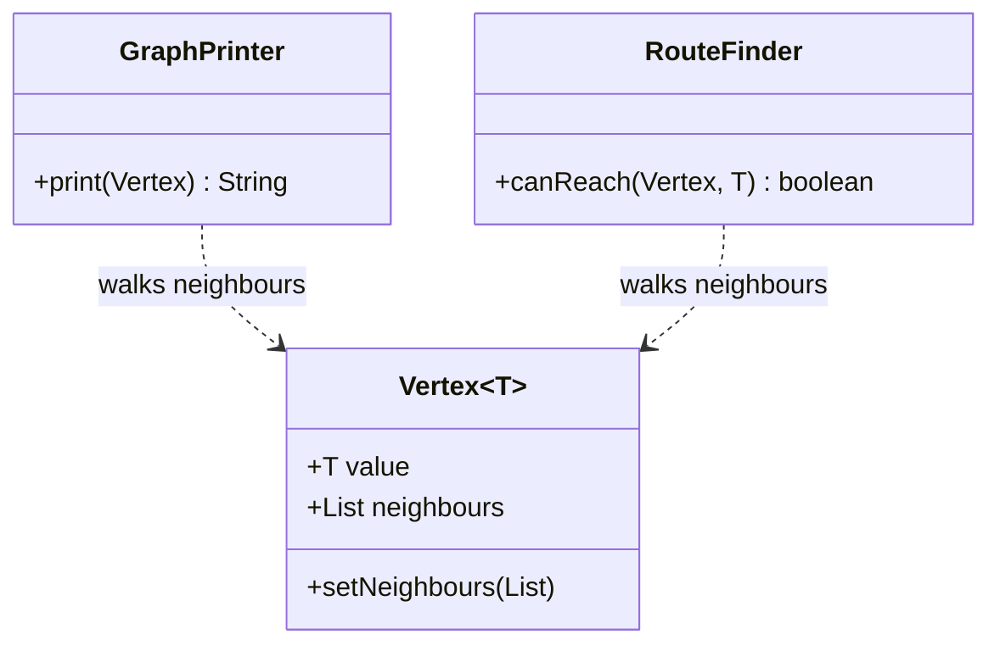
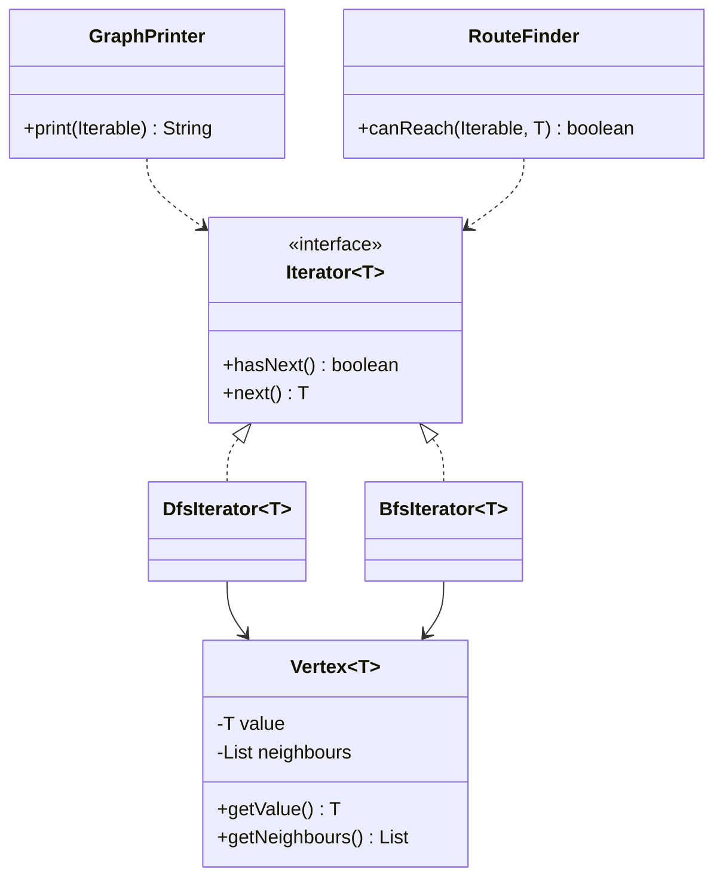

# Iterator — DFS

**Week 7 · Behavioral**

## Intent
Provide a way to access the elements of an aggregate one by one without exposing its internal structure,
and keep the traversal algorithm in its own object.

## The problem (`main`)
- `Vertex` exposes `value` and `neighbours` as public fields so clients can walk the graph.
- `GraphPrinter.print` and `RouteFinder.canReach` each contain the same stack + visited-set DFS loop.
- A bug fix in the traversal (e.g. cycle handling) has to be repeated in every client.
- Switching to breadth-first order means rewriting every client.

## The solution (`solution/iterator-dfs`)
- `Vertex` (aggregate) keeps its fields private and exposes read-only accessors.
- `DfsIterator` (concrete iterator) implements `java.util.Iterator<T>`: depth-first, cycle-safe.
- `BfsIterator` (concrete iterator) gives breadth-first order behind the same interface.
- `GraphPrinter` / `RouteFinder` (clients) accept an `Iterable<T>` and use a plain for-each loop.
- An `Iterable` lambda (`() -> new DfsIterator<>(a)`) hands out a fresh iterator per loop, which replaces the old `reset()`.

## Before

## After

## Compare
[problem/iterator-dfs...solution/iterator-dfs](https://github.com/vamekh/ug-design-patterns-2025/compare/problem/iterator-dfs...solution/iterator-dfs)

## Discussion
- Use it when an aggregate has non-trivial structure (trees, graphs) or several traversal orders.
- Java already defines the roles: `Iterable` (aggregate) and `Iterator`; implementing them unlocks for-each loops and streams.
- Cost: one class per traversal; iterators that hold state are not thread-safe and must not be shared.
- Related: Composite (iterating trees), Factory Method (`iterator()` creates the concrete iterator), Visitor.
