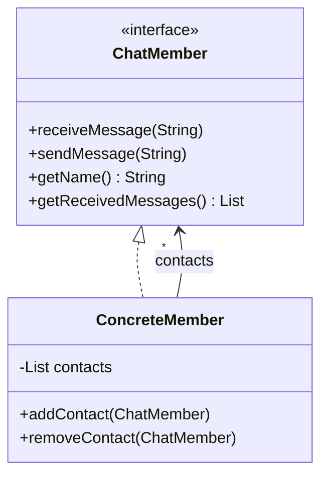
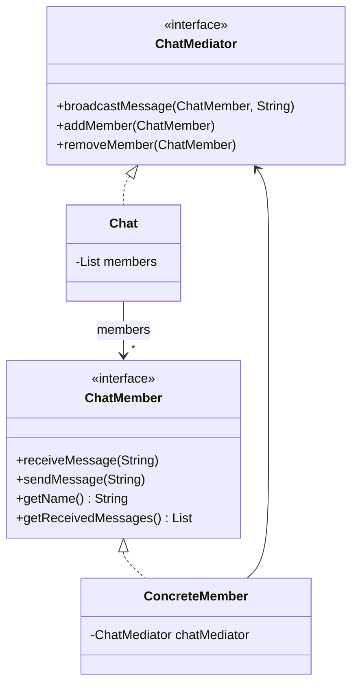

# Mediator — Chat

**Week 9 · Behavioral**

## Intent
Define an object that encapsulates how a set of objects interact, so they don't refer to each other
directly and their interaction can change independently.

## The problem (`main`)
- Every `ConcreteMember` keeps a `contacts` list with all other members.
- `sendMessage` loops over those contacts and calls `receiveMessage` on each: n members need n*(n-1) links.
- Joining means `addContact` on every existing member and vice versa; leaving means `removeContact` everywhere.
- A forgotten link silently loses messages or keeps delivering to someone who left.

## The solution (`solution/mediator-chat`)
- `ChatMediator` (mediator) declares `addMember`, `removeMember`, `broadcastMessage`.
- `Chat` (concrete mediator) is the only object holding the member list; it delivers to everyone except the sender.
- `ChatMember` / `ConcreteMember` (colleagues) know only the mediator; the constructor registers with it.
- Joining is one constructor call, leaving is one `removeMember` call.

## Before

## After

## Compare
[problem/mediator-chat...solution/mediator-chat](https://github.com/vamekh/ug-design-patterns-2025/compare/problem/mediator-chat...solution/mediator-chat)

## Discussion
- Use it when many objects talk to many others (chat rooms, UI dialogs, air-traffic control) and the wiring gets tangled.
- Cost: the mediator can grow into a "god object" that knows too much; keep it focused on coordination.
- Mediator centralises communication; Observer distributes it. They are often combined (members subscribe to the mediator).
- Related: Facade (simplifies a subsystem, but one-way), Observer, Command.
