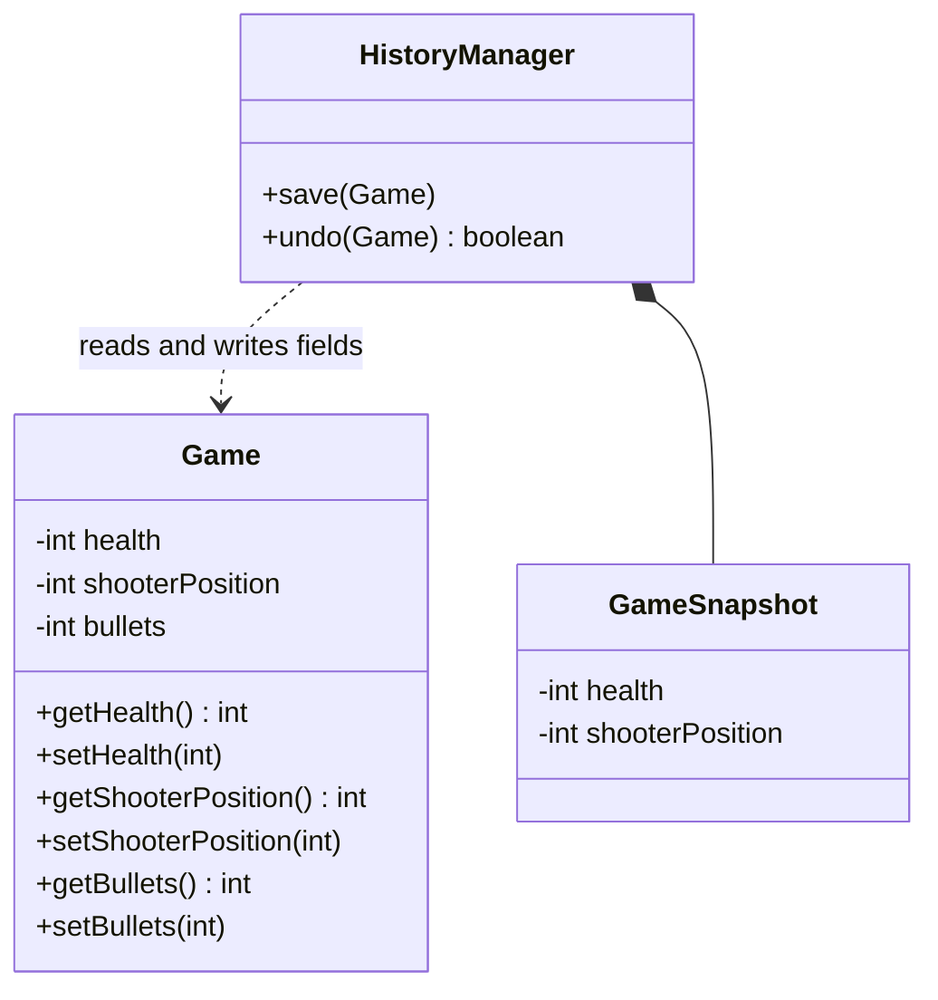
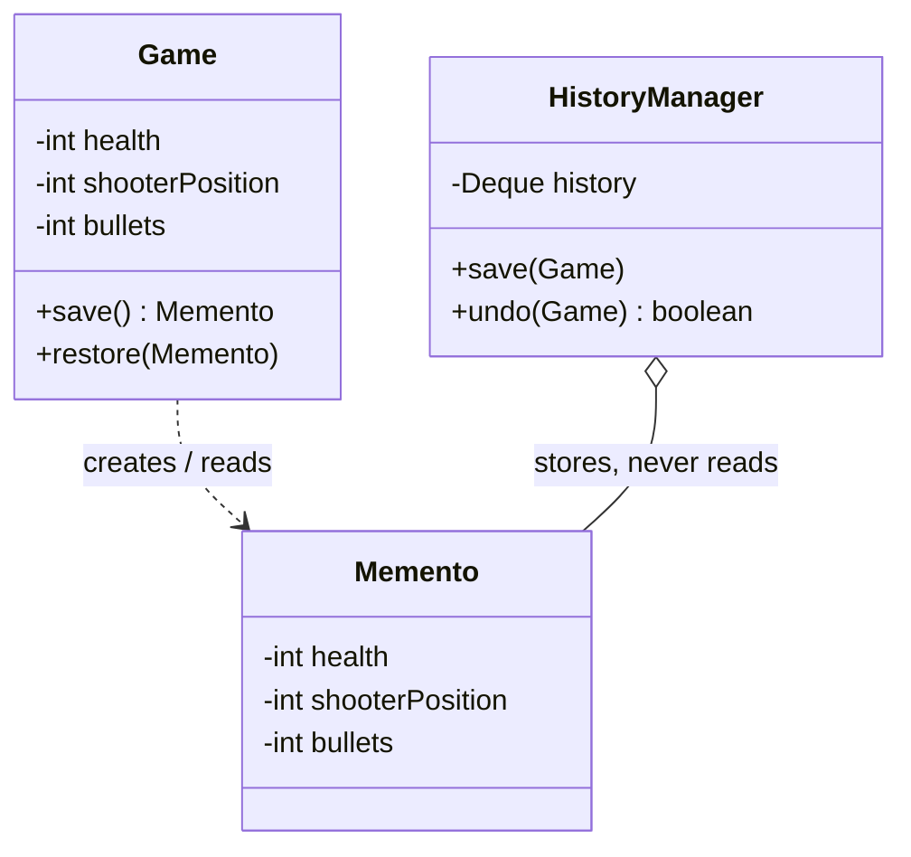

# Memento — Game

**Week 7 · Behavioral**

## Intent
Capture an object's internal state in a snapshot so it can be restored later, without exposing that state
to the objects that store the snapshot.

## The problem (`main`)
- `Game` has public setters for `health`, `shooterPosition` and `bullets` only so that saving is possible.
- Any code can now put `Game` into an impossible state (`setBullets(-5)`).
- `HistoryManager` knows every field of `Game` and copies them into its own `GameSnapshot`.
- Adding a field to `Game` silently breaks undo: `bullets` was never copied.

## The solution (`solution/memento-game`)
- `Game` (originator) creates a snapshot with `save()` and reloads it with `restore(Memento)`; setters are removed.
- `Game.Memento` (memento) is a `public static final` nested class with private fields and a private constructor, so only `Game` can create or read it.
- `HistoryManager` (caretaker) is an undo stack: `save(game)` pushes, `undo(game)` pops and restores.
- A new field in `Game` only touches `Game` and its `Memento`, both in the same file.

## Before

## After

## Compare
[problem/memento-game...solution/memento-game](https://github.com/vamekh/ug-design-patterns-2025/compare/problem/memento-game...solution/memento-game)

## Discussion
- Use it for undo, checkpoints and rollback when the originator's state should stay private.
- Cost: every snapshot is a full copy, so memory grows with history length; caretakers may need a limit.
- Java's nested-class access rules give the "narrow interface" for free: outsiders see only an opaque type.
- Related: Command (undo via mementos), Prototype (copying state), Iterator (saving iteration position).
