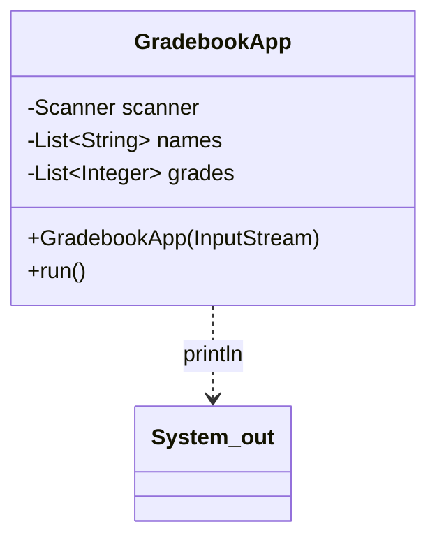
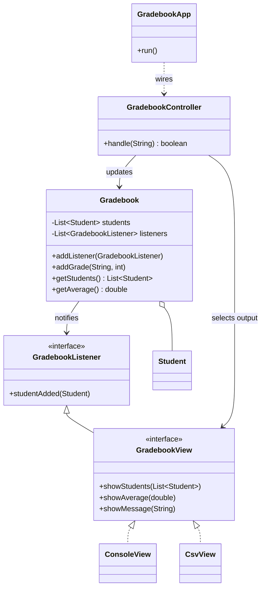

# MVC — Gradebook

**Week 11 · Architectural**

## Intent
Separate an interactive application into a Model (data and rules), Views (presentation) and a Controller (input handling) so each can change, be replaced or be tested on its own.

## The problem (`main`)
- `GradebookApp` reads commands from a `Scanner`, stores grades in two parallel lists, validates them and prints with `System.out` – all in one `run()` method.
- The average or the validation rule can only be tested by feeding console text in and searching the printed output.
- A second UI (CSV export, GUI, REST) would have to copy the parsing and the business logic.
- Presentation details leak into tests: `printf` without a locale prints `88,00` on some machines.

## The solution (`solution/mvc-gradebook`)
- `model.Student`, `model.Gradebook` (Model): data, validation and `getAverage()`; notifies `GradebookListener`s when a student is added (Observer).
- `view.GradebookView` (View interface) with `ConsoleView` (the original output) and `CsvView` (a second view added without touching the model or controller).
- `controller.GradebookController` (Controller): turns a command line into model calls and view calls; `handle()` returns `false` on `quit`.
- `GradebookApp` only wires M, V and C together and feeds input lines to the controller.
- Tests use a `RecordingView` fake and assert on the model directly.

## Before

## After

## Compare
[problem/mvc-gradebook...solution/mvc-gradebook](https://github.com/vamekh/ug-design-patterns-2025/compare/problem/mvc-gradebook...solution/mvc-gradebook)

## Discussion
- MVC is an architectural pattern built from smaller ones: Observer (model → views), Strategy (a view/controller pair can be swapped), often Composite for nested views.
- The model must not import anything from `view` or `controller` – that dependency direction is what makes a second UI cheap.
- Costs: more classes and indirection for a tiny app; variants (MVP, MVVM) move more logic out of the view to make it even easier to test.
