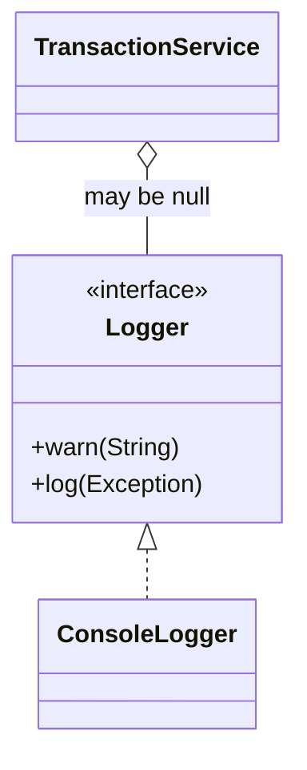
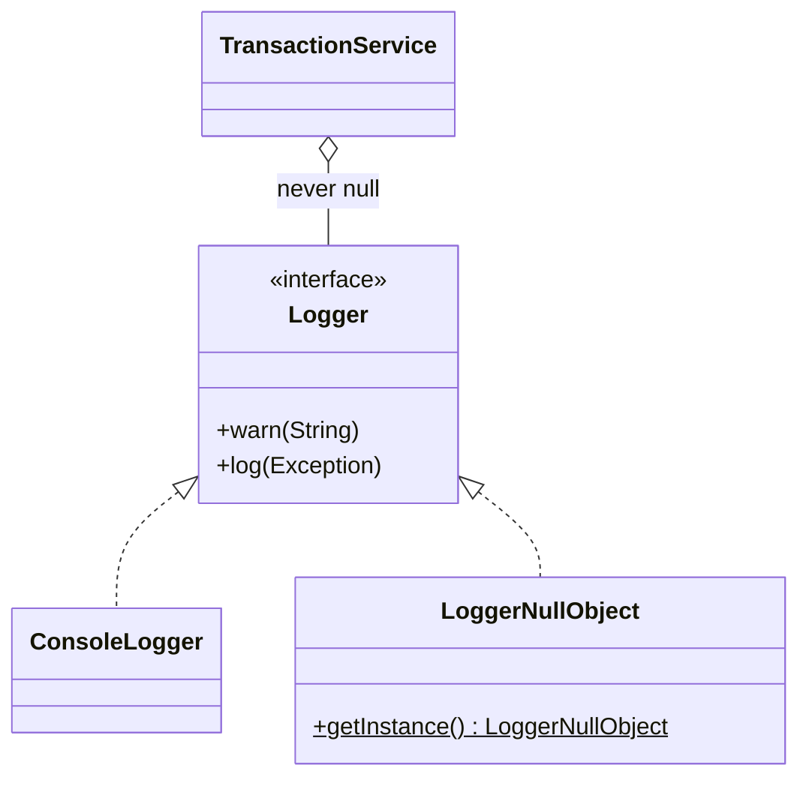

# Null Object — Logger

**Week 10 · Behavioral**

## Intent
Provide a do-nothing implementation of an interface to use instead of `null`, so collaborators can always be called without checks.

## The problem (`main`)
- Logging is optional, so `TransactionService` may hold a `null` `Logger`.
- Each of the three log calls in `processTransaction()` is wrapped in `if (logger != null)`.
- Each new log statement needs the same check. One forgotten check makes "no logging" crash with a `NullPointerException`.
- (In the original classwork the constructor assigned the *parameter* `logger = ...` instead of the field, which was confusing and easy to get wrong.)

## The solution (`solution/null-object-logger`)
- `Logger` (Abstract Object) and `ConsoleLogger` (Real Object) are unchanged.
- `LoggerNullObject` (Null Object) has `warn()` and `log()` methods that do nothing. It is a singleton.
- `TransactionService` (Client) normalises its dependency once: `this.logger = logger != null ? logger : LoggerNullObject.getInstance()`. After that it calls the logger without any checks.

## Before

## After

## Compare
[problem/null-object-logger...solution/null-object-logger](https://github.com/vamekh/ug-design-patterns-2025/compare/problem/null-object-logger...solution/null-object-logger)

## Discussion
- Loggers, listeners and callbacks are the classic use case: "nobody is listening" is a valid, silent behaviour.
- Replace `null` at the boundary (constructor or factory) so the rest of the class never sees it.
- Do not use it when the caller needs to *know* the collaborator is missing. In that case use `Optional` or an explicit check.
- Related: Singleton, Strategy, the `NoCommand` object in Command.
