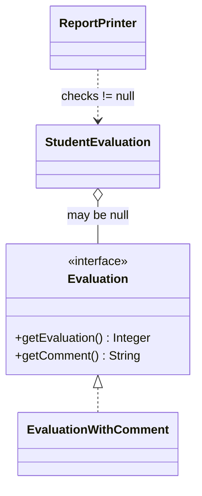
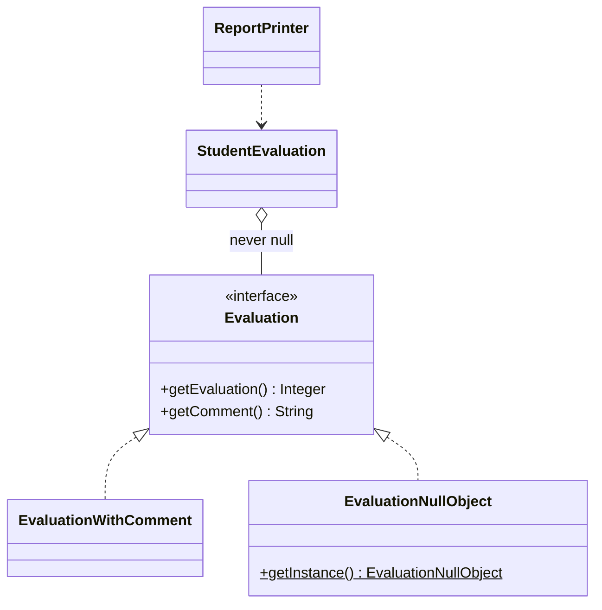

# Null Object — Student Evaluation

**Week 10 · Behavioral**

## Intent
Replace a `null` reference with an object that implements the expected interface but has neutral ("do nothing" / default) behaviour, so clients do not have to check for null.

## The problem (`main`)
- `StudentEvaluation(ugCode)` stores `null` for a student who has not been evaluated, and `getEvaluation()` returns it.
- `ReportPrinter.line()` and `totalPoints()` each repeat `if (evaluation != null)` and hard-code the fallback values (`0`, `"Not yet evaluated!"`).
- Every new caller has to remember the check. The test shows the `NullPointerException` you get when one forgets.

## The solution (`solution/null-object-studentevaluation`)
- `Evaluation` (Abstract Object) is unchanged.
- `EvaluationWithComment` (Real Object) is unchanged.
- `EvaluationNullObject` (Null Object) returns `0` points and `"Not yet evaluated!"`. It is a stateless singleton (`getInstance()`).
- `StudentEvaluation(ugCode)` now uses the null object, so `getEvaluation()` never returns null.
- `ReportPrinter` (Client) has no null checks, and the fallback values live in one class.

## Before

## After

## Compare
[problem/null-object-studentevaluation...solution/null-object-studentevaluation](https://github.com/vamekh/ug-design-patterns-2025/compare/problem/null-object-studentevaluation...solution/null-object-studentevaluation)

## Discussion
- Use a Null Object when "absent" has a sensible default behaviour. If absence is an error, fail fast instead.
- A risk is that the null object can hide real bugs (a grade that *should* exist silently shows 0). Make sure the neutral behaviour is really neutral.
- The real `null` comment of student 126 still prints `null`. Null Object handles a missing *object*, not missing fields inside a real one.
- Related: Singleton (one shared null instance), Strategy/State (null object as a "do nothing" strategy), `Optional` in Java.
