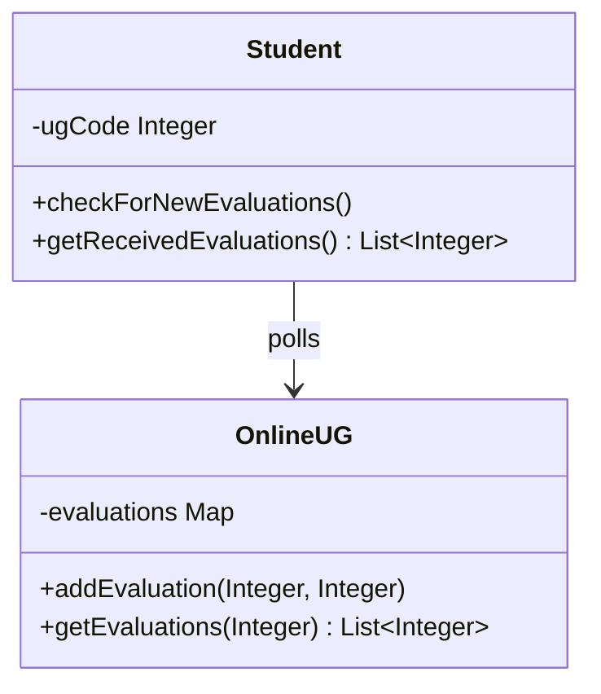
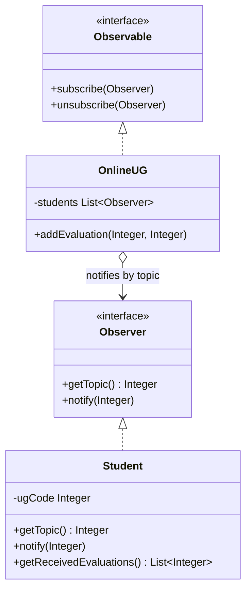

# Observer — Evaluation Notifier

**Week 6 · Behavioral**

## Intent
Define a one-to-many dependency, so that when one object (the subject) changes, all of its dependents (observers) are notified automatically.

## The problem (`main`)
- `OnlineUG` only stores the evaluations for each UG code and returns them through `getEvaluations(ugCode)`.
- Each `Student` must call `checkForNewEvaluations()` (polling) and remember how many grades it has already seen.
- Until a student checks, nobody knows that a grade was posted.
- `Student` depends on the concrete `OnlineUG` class.

## The solution (`solution/observer-evaluationnotifier`)
- `Observable` (subject interface): `subscribe` and `unsubscribe`.
- `Observer` (observer interface): `getTopic()` returns the UG code the student cares about, and `notify(evaluation)` delivers a grade.
- `OnlineUG` (concrete subject) notifies only the observers whose topic matches in `addEvaluation()`.
- `Student` (concrete observer) only collects the grades it receives.
- The topic is compared with `ugCode.equals(...)`. With `==`, `Integer` values above 127 are different objects, so nobody would be notified.

## Before

## After

## Compare
[problem/observer-evaluationnotifier...solution/observer-evaluationnotifier](https://github.com/vamekh/ug-design-patterns-2025/compare/problem/observer-evaluationnotifier...solution/observer-evaluationnotifier)

## Discussion
- This is topic-based Observer: the subject filters, so each observer receives only its own events. With many topics, a `Map<topic, List<Observer>>` avoids scanning every observer.
- Pitfall: compare boxed values (`Integer`, `Long`) with `equals`. `==` happens to work only for the cached range from -128 to 127.
- Cost: the subject decides what an observer is told. Observers that need more context have to pull it from the subject.
- Related: publish/subscribe message brokers apply the same idea across processes.
