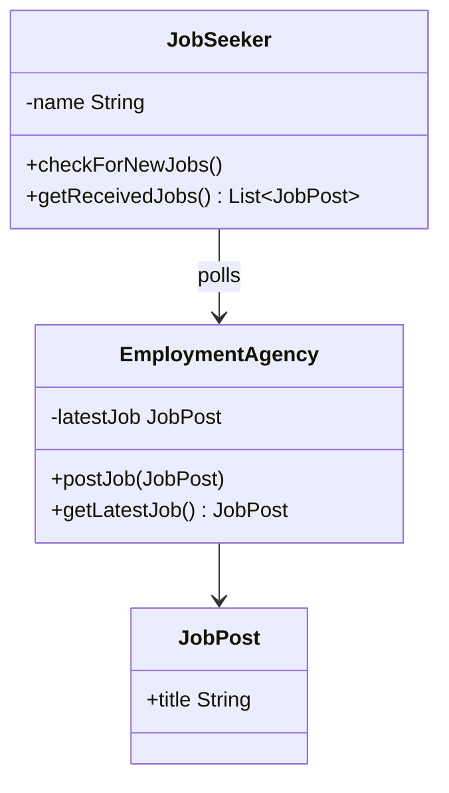
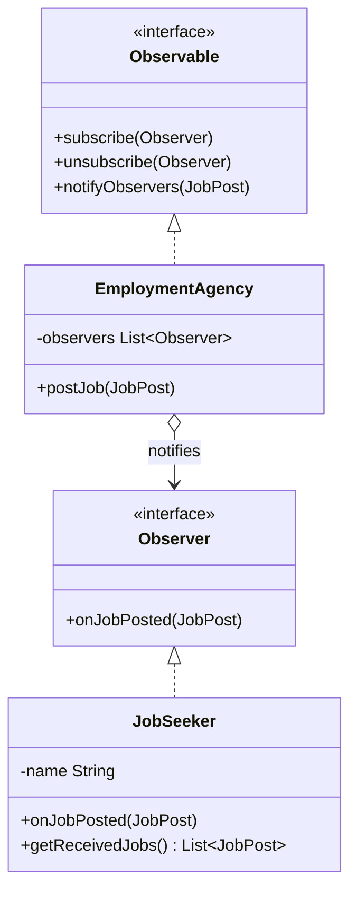

# Observer — JobSeeker

**Week 6 · Behavioral**

## Intent
Define a one-to-many dependency, so that when one object (the subject) changes, all of its dependents (observers) are notified automatically.

## The problem (`main`)
- `EmploymentAgency` only stores the latest `JobPost` and makes it available through `getLatestJob()`.
- Each `JobSeeker` keeps a reference to the agency and must call `checkForNewJobs()` again and again (polling).
- If two jobs are posted between two checks, the first one is lost (Monica never sees "Dancer").
- Checks made when nothing is new are wasted work. The caller decides how often to poll.

## The solution (`solution/observer-jobseeker`)
- `Observable` (subject interface): `subscribe`, `unsubscribe` and `notifyObservers`.
- `Observer` (observer interface): `onJobPosted(JobPost)`.
- `EmploymentAgency` (concrete subject) keeps a `List<Observer>` and pushes every post in `postJob()`.
- `JobSeeker` (concrete observer) only reacts to notifications and no longer knows about the agency.
- `unsubscribe()` stops the notifications for one job seeker without affecting the others.

## Before

## After

## Compare
[problem/observer-jobseeker...solution/observer-jobseeker](https://github.com/vamekh/ug-design-patterns-2025/compare/problem/observer-jobseeker...solution/observer-jobseeker)

## Discussion
- Use it when many objects must react to changes in one object and the subject should not depend on their concrete classes.
- Push or pull: this version pushes the whole `JobPost`. Pull-style observers get only a signal and then query the subject.
- Costs: notification order is not specified, and observers that are never unsubscribed stay in memory (the "lapsed listener" problem).
- Related: Mediator also decouples objects, but it routes messages through a central object. Event buses and listeners in UI frameworks are applications of Observer.
