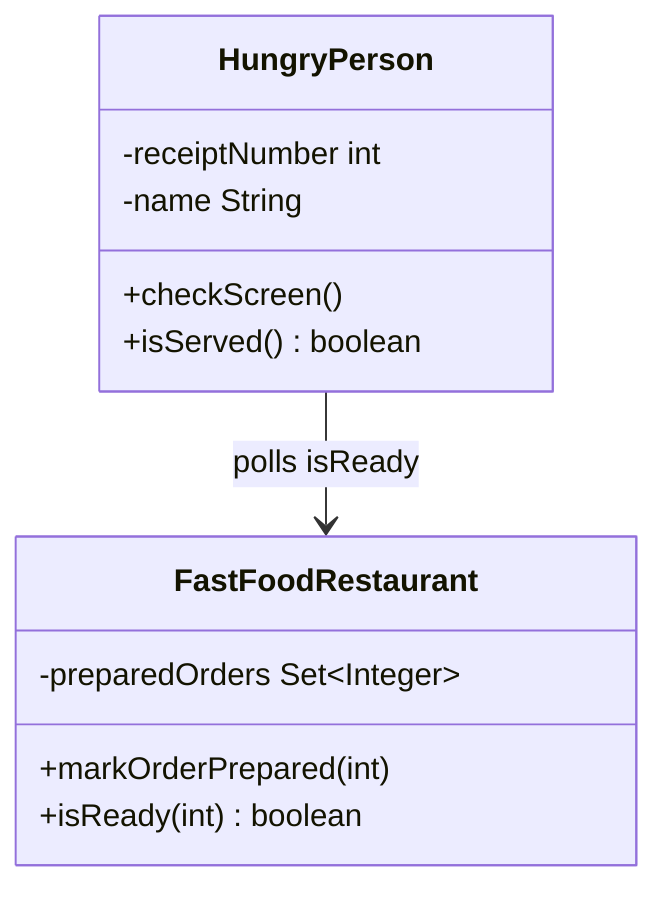
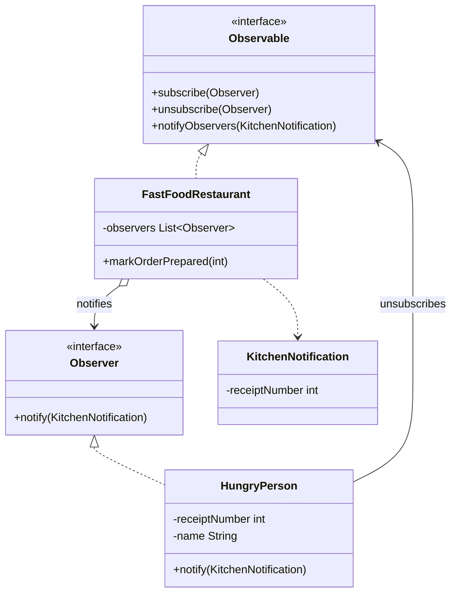

# Observer — Restaurant

**Week 6 · Behavioral**

## Intent
Define a one-to-many dependency, so that when one object (the subject) changes, all of its dependents (observers) are notified automatically.

## The problem (`main`)
- `FastFoodRestaurant` only stores the prepared receipt numbers and answers `isReady(receipt)`.
- Each `HungryPerson` must call `checkScreen()` again and again (polling) until its number shows up.
- The caller has to drive every check. In the test, Jane checks 11 times and John 15 times.
- `HungryPerson` depends on the concrete `FastFoodRestaurant` class.

## The solution (`solution/observer-restaurant`)
- `Observable` (subject interface) and `Observer` (observer interface with `notify(KitchenNotification)`).
- `FastFoodRestaurant` (concrete subject) sends a `KitchenNotification` to all subscribers from `markOrderPrepared()`.
- `HungryPerson` (concrete observer) reacts to the notification and unsubscribes itself once it is served.
- `notifyObservers()` iterates over a copy of the list. An observer can unsubscribe while it is being notified without a `ConcurrentModificationException`.

## Before

## After

## Compare
[problem/observer-restaurant...solution/observer-restaurant](https://github.com/vamekh/ug-design-patterns-2025/compare/problem/observer-restaurant...solution/observer-restaurant)

## Discussion
- Use it when the moment of a change matters to many objects and none of them should have to keep asking.
- Here every customer receives every notification and filters it by receipt number. With many observers, a subject that delivers notifications by topic is more efficient.
- An observer that changes the subscriber list while being notified is a common bug. Iterate over a copy, or use `CopyOnWriteArrayList`.
- Related: the evaluation-notifier example filters by topic. Mediator centralises the communication between objects.
