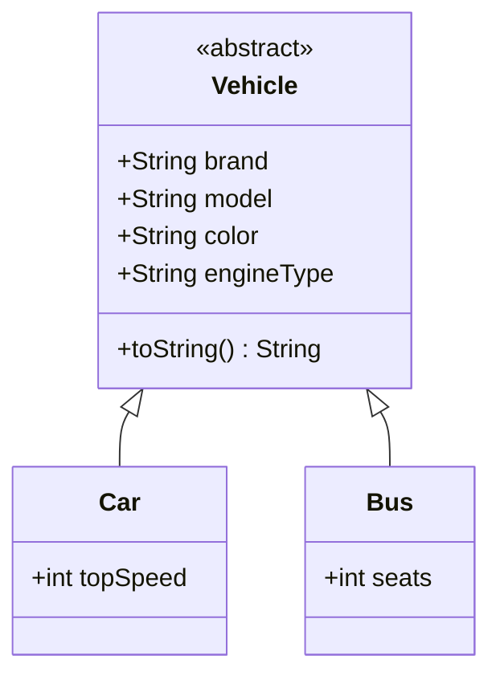
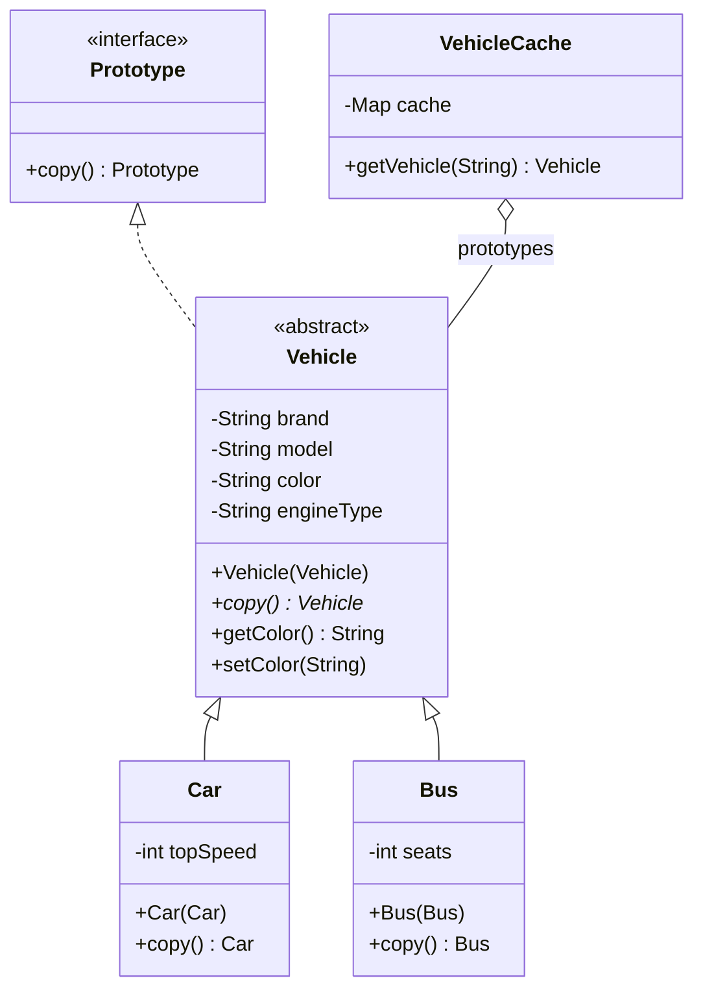

# Prototype — Cars

**Week 2 · Creational**

## Intent
Create new objects by copying an existing instance (the prototype) instead of building them from scratch. The object itself knows how to copy itself, including its private state and its concrete type.

## The problem (`main`)
- `CarsTest` clones a `Car` by calling `new Car(tesla.brand, tesla.model, tesla.color, tesla.engineType, tesla.topSpeed)`, so the client must know every field.
- This works only because all fields are `public`. Make one private and the copy is impossible.
- The client must know the *concrete* class. Copying a `Vehicle` of unknown type (`Car` or `Bus`) would need `instanceof` checks.
- Each new field means updating every place that copies vehicles.

## The solution (`solution/prototype-cars`)
- The `Prototype` interface declares `copy()` (not `clone()`, so it does not clash with `Object.clone()`).
- `Vehicle` implements it with an abstract covariant `copy()` and a copy constructor `Vehicle(Vehicle)`.
- `Car(Car)` and `Bus(Bus)` copy constructors, plus `copy()` overrides, copy their own fields. All fields are now private, with getters (and `setColor()` for the one value the client changes).
- The client copies a `List<Vehicle>` with `map(Vehicle::copy)` without knowing the concrete types; the test checks each copy is a different object of the same type with the same content.
- `VehicleCache` (Prototype Registry) keeps preconfigured `"sport-car"`/`"family-car"` prototypes and hands out fresh copies. An unknown key throws `IllegalArgumentException`.

## Before

## After

## Compare
[problem/prototype-cars...solution/prototype-cars](https://github.com/vamekh/ug-design-patterns-2025/compare/problem/prototype-cars...solution/prototype-cars)

## Discussion
- Copy constructors with a `copy()` method are the idiomatic Java approach. Avoid `Object.clone()`/`Cloneable`, which is shallow by default, throws a checked exception and bypasses constructors.
- Shallow versus deep copy: fine here because all fields are immutable (`String`, `int`). Mutable fields (lists, nested objects) must be copied explicitly.
- A registry (`VehicleCache`) turns prototypes into configurable presets, an alternative to many factory subclasses.
- Related: Factory Method / Abstract Factory (a factory can return clones of prototypes), Memento (snapshots are often copies), Builder.
