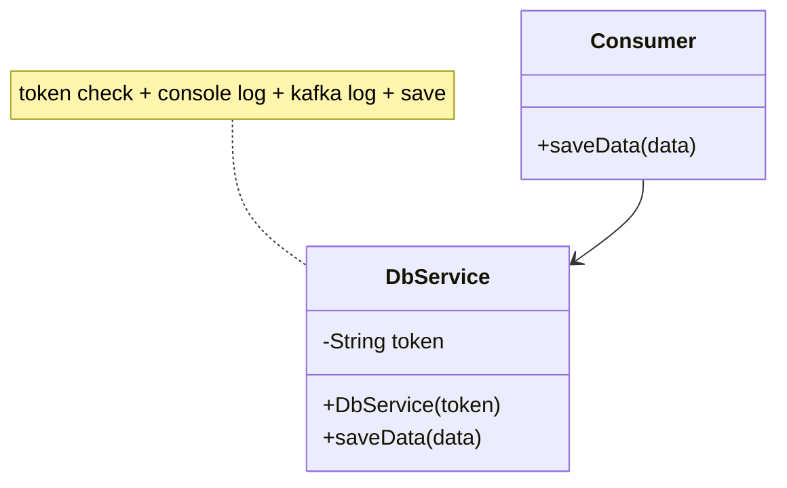
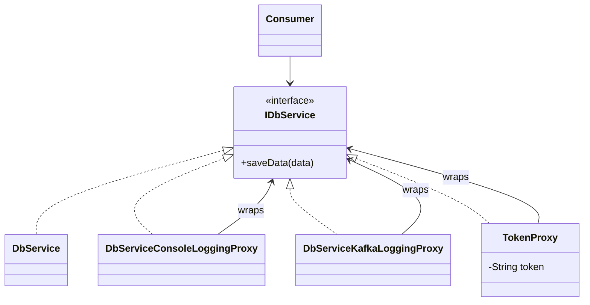

# Proxy — DbService (logging and protection proxies)

**Week 3 · Structural**

## Intent
Provide a stand-in object with the same interface as the real one, so it can control access to it: check permissions, log calls, cache, or delay creation.

## The problem (`main`)
- `DbService.saveData` checks the auth token, logs to the console and to "kafka", and then saves. Four concerns sit in one method.
- The token check and logging cannot be switched off, reordered or reused for another service without editing `DbService`.
- `DbService` needs a token in its constructor even where auth is not needed (e.g. a batch job or a test).
- `Consumer` depends on the concrete `DbService`.

## The solution (`solution/proxy-dbservice`)
- `IDbService` (Subject) is the shared interface; `Consumer` (Client) depends only on it.
- `DbService` (Real Subject) only saves data.
- `DbServiceConsoleLoggingProxy` and `DbServiceKafkaLoggingProxy` (Logging Proxies) log and delegate to the wrapped `IDbService`, which can be another proxy.
- `TokenProxy` (Protection Proxy) throws `SecurityException` for an invalid token, so nothing behind it (logging or `DbService`) runs.
- The chain is built when wiring: `new TokenProxy(new DbServiceConsoleLoggingProxy(new DbServiceKafkaLoggingProxy(new DbService())), token)`.

## Before

## After

## Compare
[problem/proxy-dbservice...solution/proxy-dbservice](https://github.com/vamekh/ug-design-patterns-2025/compare/problem/proxy-dbservice...solution/proxy-dbservice)

## Discussion
- Put the protection proxy outermost, so a rejected call costs nothing and is not even logged; the order of wrapping is the order of execution.
- Stacked proxies look exactly like Decorator. The difference is intent: a proxy controls access to the subject (auth, lazy load, remote call), a decorator adds features.
- Cost: one class per concern and a wiring step; Spring AOP and `java.lang.reflect.Proxy` generate such proxies for many methods at once.
- Related: `proxy-imageprocessor` (virtual proxy), Decorator, Chain of Responsibility (handlers that may stop the request).
