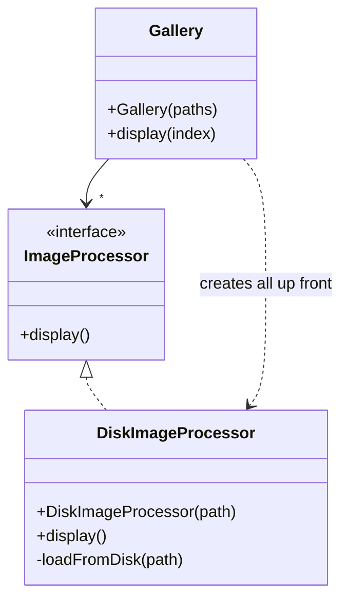
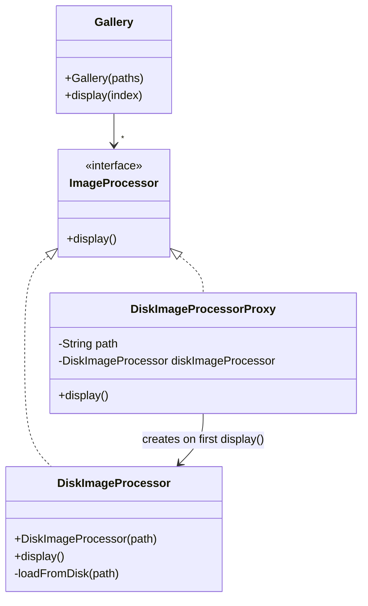

# Proxy — ImageProcessor (virtual proxy)

**Week 3 · Structural**

## Intent
Provide a placeholder for another object to control access to it. A virtual proxy delays creating an expensive object until it is really needed.

## The problem (`main`)
- `DiskImageProcessor` loads its image from disk in the constructor (an expensive operation).
- `Gallery` creates a `DiskImageProcessor` for every path in its own constructor.
- Opening a gallery of 5 images costs 5 disk loads, even if the user displays only one (`GalleryTest` counts them with `DiskImageProcessor.getLoadCount()`).

## The solution (`solution/proxy-imageprocessor`)
- `ImageProcessor` (Subject) is the interface both the real image and the proxy implement.
- `DiskImageProcessor` (Real Subject) is unchanged: it still loads in its constructor.
- `DiskImageProcessorProxy` (Virtual Proxy) only stores the `path`. On the first `display()` it creates the real `DiskImageProcessor(path)`, keeps it, and delegates; later calls reuse it.
- `Gallery` (Client) changes one line: `new DiskImageProcessorProxy(path)` instead of `new DiskImageProcessor(path)`.

## Before

## After

## Compare
[problem/proxy-imageprocessor...solution/proxy-imageprocessor](https://github.com/vamekh/ug-design-patterns-2025/compare/problem/proxy-imageprocessor...solution/proxy-imageprocessor)

## Discussion
- Use a virtual proxy for heavy objects that are often never used: images, documents, ORM lazy-loaded relations (Hibernate proxies).
- Cost: the first `display()` is slow instead of the start-up; this proxy is not thread-safe (two threads could both load).
- Other proxy kinds: protection proxy (access checks), remote proxy (network stub), logging/caching proxy — see `proxy-dbservice`.
- Related: Decorator has the same structure but adds behaviour; a proxy controls access to, and often the lifecycle of, its subject.
