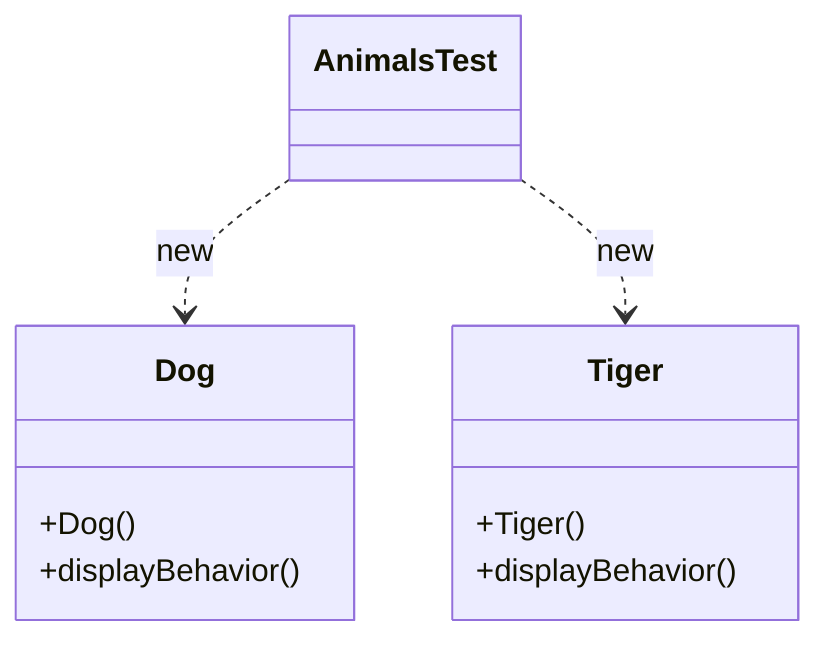
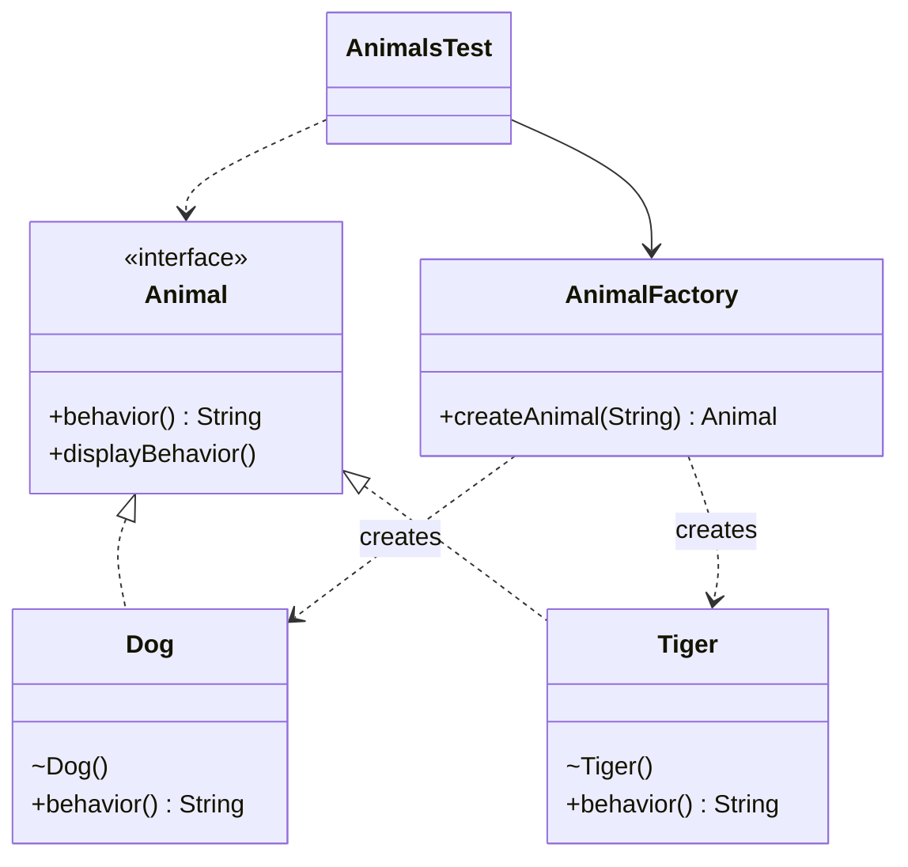

# Simple Factory — Animals

**Week 1 · Creational**

## Intent
Put the decision about *which concrete class to instantiate* in one place: a factory method that takes a parameter and returns an abstract type. Clients ask for "a dog" instead of calling `new Dog()`.

## The problem (`main`)
- The client (`AnimalsTest`) calls `new Tiger()` and `new Dog()` directly, so it is coupled to every concrete class.
- `Tiger` and `Dog` have no common type, so the client can't treat them uniformly (for example in a loop over a list of animals).
- Creating animals from data (a config value, user input) would need an `if/else` in every client that does it.

## The solution (`solution/simple-factory-animals`)
- The `Animal` interface gives `Dog` and `Tiger` a common type. `behavior()` returns the text, and the default `displayBehavior()` prints it, so the classes no longer print as a side effect of construction.
- `AnimalFactory.createAnimal(String type)` maps `"dog"`/`"tiger"` (case-insensitive) to the right class and rejects unknown or `null` types with an `IllegalArgumentException` (the factory itself prints nothing).
- The `Dog` and `Tiger` constructors become package-private, which nudges clients toward the factory.
- The client turns the CSV `"Tiger, Dog"` into animals with `map(animalFactory::createAnimal)` and works only with `Animal`. The test checks the returned types and behaviours.

## Before

## After

## Compare
[problem/simple-factory-animals...solution/simple-factory-animals](https://github.com/vamekh/ug-design-patterns-2025/compare/problem/simple-factory-animals...solution/simple-factory-animals)

## Discussion
- Simple Factory is an idiom, not a GoF pattern. It centralises creation, but the factory's `if/else` still has to be edited for each new animal, so it is not fully open/closed.
- Good fit: a small, stable set of types chosen from data (strings, enums, config).
- When the set of types grows or varies by context, move to Factory Method (subclasses decide) or Abstract Factory (families of products), both in week 2.
- Related: Factory Method, Abstract Factory, Golden Hammer (week 12: don't add a factory where a plain `new` is fine).
