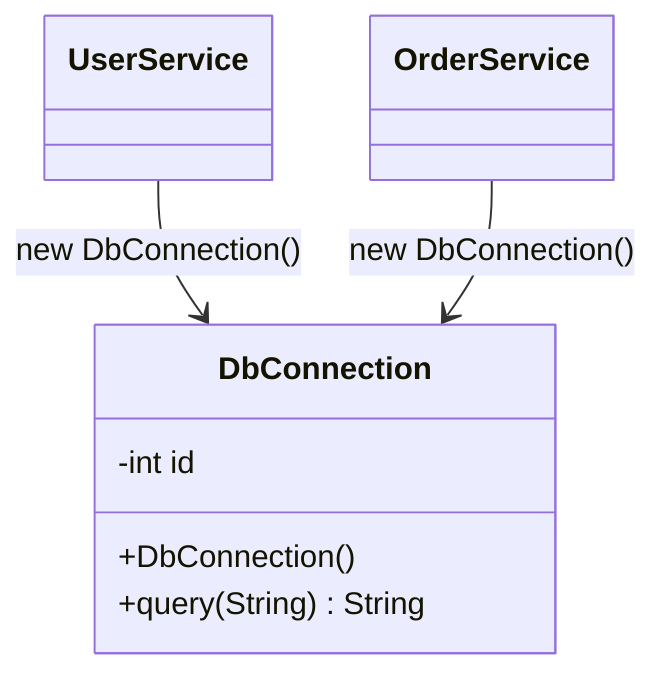
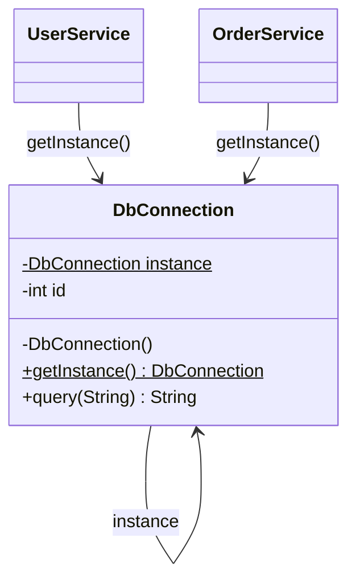

# Singleton — DbConnection

**Week 3 · Creational**

## Intent
Ensure a class has only one instance and provide a global point of access to it.

## The problem (`main`)
- `DbConnection` has a public constructor, so anyone can open a new connection.
- `UserService` and `OrderService` each call `new DbConnection()`; every service instance opens one more connection.
- `DbConnectionTest` shows the services hold different connections (different ids) and `getOpenedConnections()` grows with every service.
- A real database limits the number of connections, and opening one is slow.

## The solution (`solution/singleton-dbconnection`)
- `DbConnection` (Singleton) has a private constructor and a `private static volatile DbConnection instance`.
- `getInstance()` creates the instance lazily with double-checked locking: a fast unlocked check, then `synchronized`, then a second check so two threads that both saw `null` do not create two connections.
- `UserService` and `OrderService` call `DbConnection.getInstance()` instead of `new`.
- `testAllThreadsGetTheSameInstance` starts 20 threads at once and asserts they all receive the same object.

## Before

## After

## Compare
[problem/singleton-dbconnection...solution/singleton-dbconnection](https://github.com/vamekh/ug-design-patterns-2025/compare/problem/singleton-dbconnection...solution/singleton-dbconnection)

## Discussion
- Without the inner `if (instance == null)` two threads can both pass the outer check and create two instances; without `volatile` another thread may see a partly constructed object.
- Simpler thread-safe alternatives: the holder idiom (`private static class Holder { static final DbConnection INSTANCE = new DbConnection(); }`, lazy thanks to class loading) and an `enum DbConnection { INSTANCE; }`, which also survives serialization and reflection.
- Costs: Singleton is global state. It hides dependencies and makes tests hard to isolate (here the instance lives for the whole test run). Prefer passing the shared object in (dependency injection) when you can.
- Related: Abstract Factory, Builder and Facade objects are often singletons.
