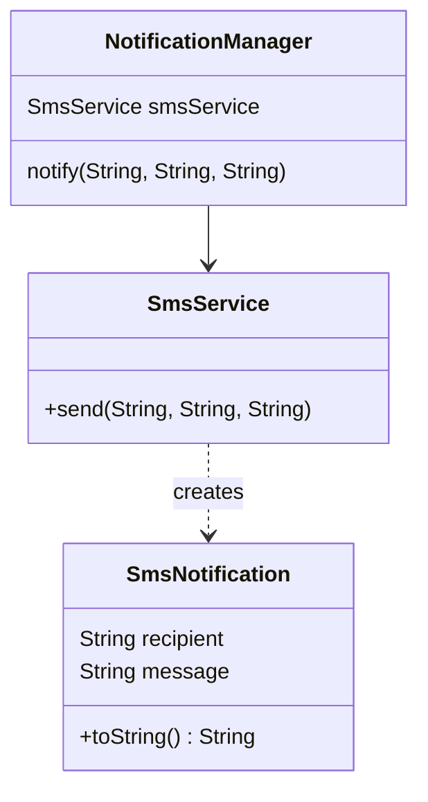
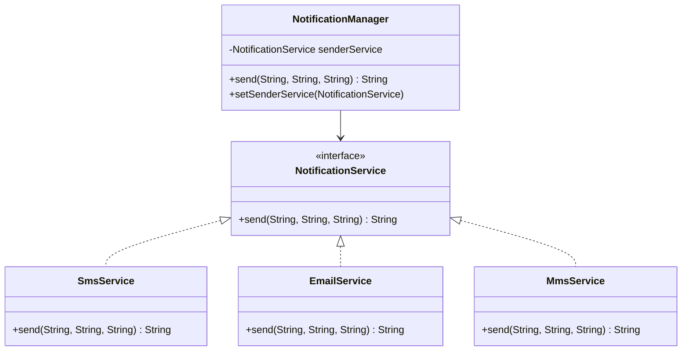

# Dependency Inversion Principle — Notifications

**Week 1 · SOLID principle**

## Intent
High-level modules should not depend on low-level modules; both should depend on abstractions. Business logic ("notify a recipient") should not care which channel delivers the message.

## The problem (`main`)
- `NotificationManager` is constructed with, and stores, a concrete `SmsService`.
- Adding e-mail or push notifications means changing `NotificationManager`'s field, its constructor and its call (`smsService.send(...)`).
- The high-level policy is tied to one low-level detail, so it can't be reused or tested with a different channel.

## The solution (`solution/solid-dip-notifications`)
- The `NotificationService` interface (`String send(recipient, title, text)`) is the abstraction. It returns the formatted message, so tests can assert what was sent. (It is not called `notify`, which would clash with `Object.notify()`.)
- `SmsService` and the new `EmailService` implement it. The SMS formatting moves into `SmsService`, and `SmsNotification` is removed.
- `NotificationManager` depends only on `NotificationService`. It receives one in its constructor and can switch channels at runtime with `setSenderService()`.
- A new channel is a new class. `MmsService` was added this way; `NotificationManager` stays unchanged.

## Before

## After

## Compare
[problem/solid-dip-notifications...solution/solid-dip-notifications](https://github.com/vamekh/ug-design-patterns-2025/compare/problem/solid-dip-notifications...solution/solid-dip-notifications)

## Discussion
- The abstraction is shaped by what the *manager* needs (send a titled message to a recipient), not by SMS details such as `SmsNotification`. The high-level side owns the interface.
- A setter allows switching at runtime, but constructor injection alone is often enough and keeps the object immutable.
- Tests can now pass a recording fake `NotificationService` (a lambda) instead of reading the console; `NotificationManagerTest` does exactly that.
- Related: Strategy (the channels are interchangeable strategies), Observer (fan out to several channels), Adapter (wrap a third-party SMS SDK behind `NotificationService`).
