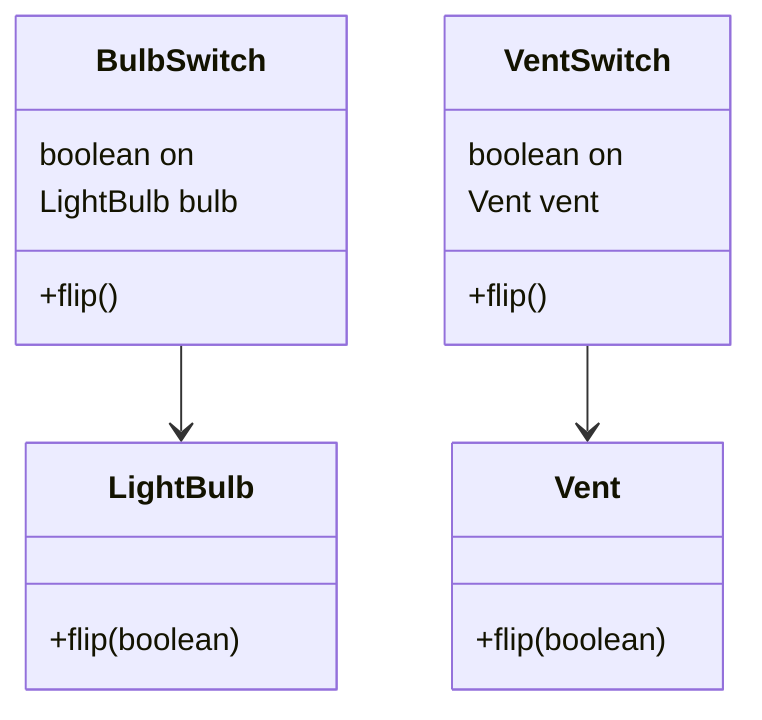
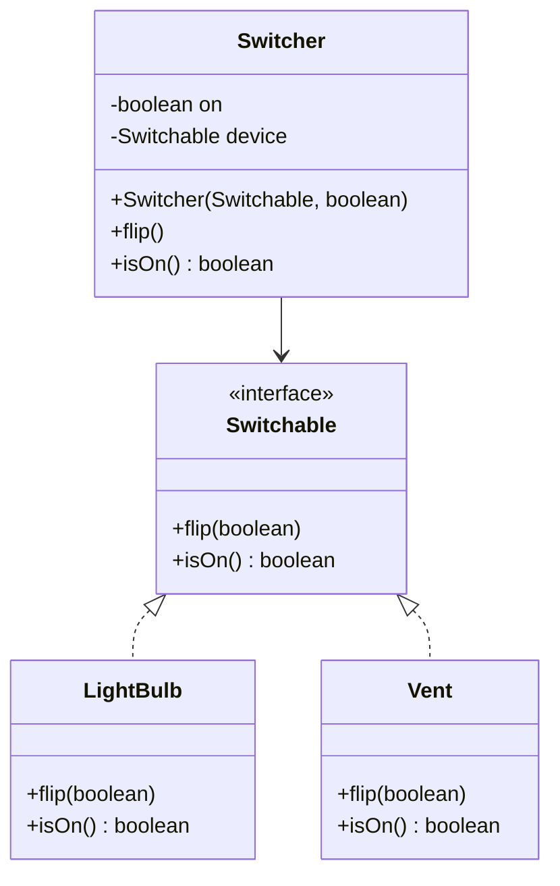

# Dependency Inversion Principle — Switch

**Week 1 · SOLID principle**

## Intent
High-level modules should not depend on low-level modules; both should depend on abstractions. The abstraction is owned by the high-level policy ("something that can be switched"), not by any particular device.

## The problem (`main`)
- `BulbSwitch` holds a concrete `LightBulb`, and `VentSwitch` holds a concrete `Vent`.
- The switching logic (`on = !on; device.flip(on)`) is duplicated in both switch classes.
- Every new device (a fan, a heater) needs yet another `XxxSwitch` class, because a switch can only control the one class it was written for.
- The copy-paste shows: `Vent.flip()` prints "Bulb is on/off".

## The solution (`solution/solid-dip-switch`)
- The `Switchable` interface (`flip(boolean on)`, `isOn()`) is the abstraction both sides depend on.
- `LightBulb` and `Vent` implement `Switchable` and remember their state. `Vent` now prints "Vent is on/off".
- One `Switcher` replaces `BulbSwitch` and `VentSwitch`. It receives any `Switchable` through its constructor.
- A new device just implements `Switchable`. `Switcher` never changes.

## Before

## After

## Compare
[problem/solid-dip-switch...solution/solid-dip-switch](https://github.com/vamekh/ug-design-patterns-2025/compare/problem/solid-dip-switch...solution/solid-dip-switch)

## Discussion
- "Inversion": before, the high-level `Switch` pointed at the low-level device. Now both point at `Switchable`, which sits on the high-level side.
- DIP (the principle) is usually achieved with Dependency Injection (the technique): pass the abstraction in through the constructor.
- Cost: one more interface and one more level of indirection. It pays off once there are two or more implementations, or when tests need a fake device.
- Related: Strategy (the device is a pluggable strategy), Bridge (Abstraction ↔ Implementor is the same idea at a larger scale), Singleton abuse (week 12) as the anti-DIP.
