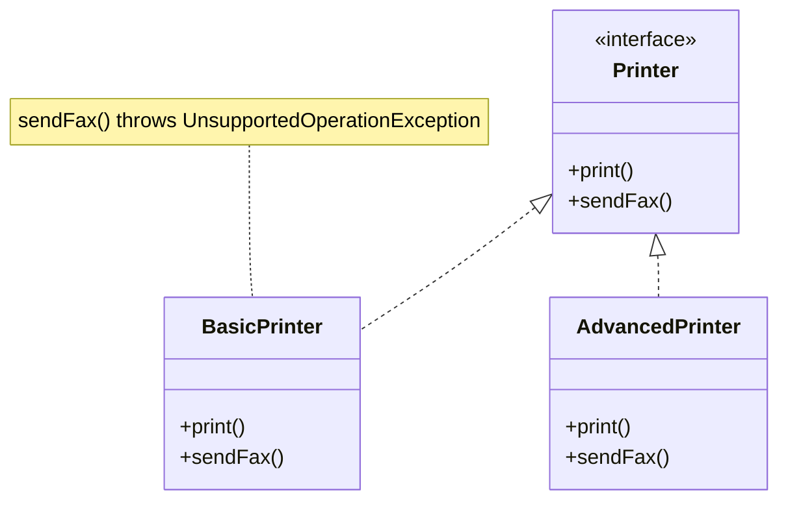
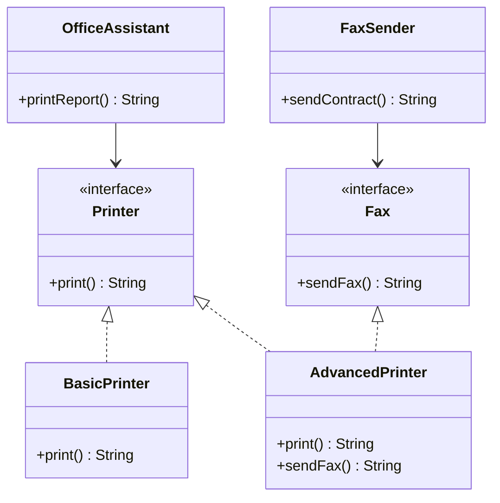

# Interface Segregation Principle — Printer

**Week 1 · SOLID principle**

## Intent
Clients should not be forced to depend on methods they don't use. Prefer several small, role-specific interfaces to one "fat" interface.

## The problem (`main`)
- `Printer` declares both `print()` and `sendFax()`.
- `BasicPrinter` can't fax but must still implement `sendFax()`, so it throws `UnsupportedOperationException`.
- Code that holds a `Printer` can't tell from the type whether `sendFax()` is safe. The failure shows up only at runtime.
- `PrinterTest` shows the crash and is tagged `@Tag("problem-demo")`.

## The solution (`solution/solid-isp-printer`)
- `Printer` is reduced to `print()`.
- The new `Fax` interface declares `sendFax()`.
- `BasicPrinter implements Printer` only. The throwing stub is gone.
- `AdvancedPrinter implements Printer, Fax`, so a device opts in to each capability it really has.
- Clients depend only on the role they use: `OfficeAssistant(Printer)` accepts any printer, `FaxSender(Fax)` accepts only fax-capable devices. Passing a `BasicPrinter` to `FaxSender` is a compile error, not a runtime crash.
- `print()` / `sendFax()` return their message so tests can assert it.

## Before

## After

## Compare
[problem/solid-isp-printer...solution/solid-isp-printer](https://github.com/vamekh/ug-design-patterns-2025/compare/problem/solid-isp-printer...solution/solid-isp-printer)

## Discussion
- The benefit appears on the *client* side. A method that only faxes should take a `Fax`, and one that only prints should take a `Printer`.
- A fat interface with throwing stubs is also an LSP violation. The two principles often show up together.
- Cost: more interfaces to name and keep track of. Split along real client roles, not one interface per method.
- Related: LSP, Adapter (to fit a class to a narrow interface), Java's own `Readable`/`Appendable`/`Closeable`.
