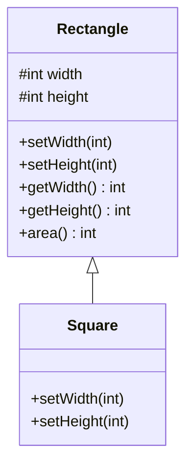
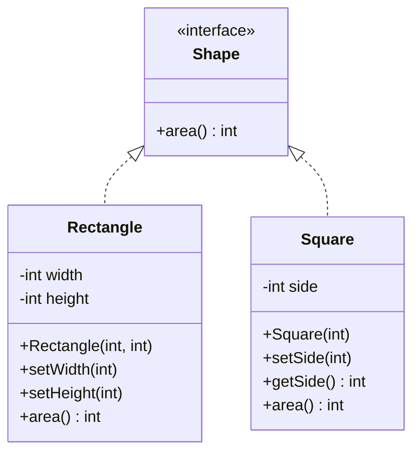

# Liskov Substitution Principle — Shapes

**Week 1 · SOLID principle**

## Intent
Subtypes must be substitutable for their base types. Code written against a base type must keep working, with the same expectations, when it is given any subtype.

## The problem (`main`)
- `Square extends Rectangle` and overrides `setWidth()`/`setHeight()` to keep the sides equal.
- Client code that relies on the `Rectangle` contract ("setting the width doesn't change the height") breaks: after `setWidth(10); setHeight(20)` a `Square` reports an area of 400 instead of 200.
- "A square is a rectangle" holds in geometry but not for *mutable* objects. The subclass strengthens the setter preconditions and changes their postconditions.
- `ShapesTest` shows the failure. It is tagged `@Tag("problem-demo")` because it fails on purpose.

## The solution (`solution/solid-lsp-shapes`)
- The new `Shape` interface holds only what both shapes truly share: `area()`.
- `Rectangle implements Shape`, with private `width`/`height`, a constructor and independent setters.
- `Square implements Shape` with a single `side` (`getSide()`/`setSide()`). It no longer inherits setters it can't honour.
- Clients that only need an area depend on `Shape`, and any implementation can be substituted safely.

## Before

## After

## Compare
[problem/solid-lsp-shapes...solution/solid-lsp-shapes](https://github.com/vamekh/ug-design-patterns-2025/compare/problem/solid-lsp-shapes...solution/solid-lsp-shapes)

## Discussion
- Warning signs of LSP violations: overrides that throw `UnsupportedOperationException`, overrides that silently do something different, and `instanceof` checks in client code.
- Inheritance should model *behavioural* "is-a", not taxonomic "is-a". When in doubt, prefer a common interface or composition.
- Immutable shapes would also fix this. With no setters there is no contract to break.
- Related: ISP (the printer example shows the same symptom as an `UnsupportedOperationException`), OCP (substitutable subtypes make extension safe).
