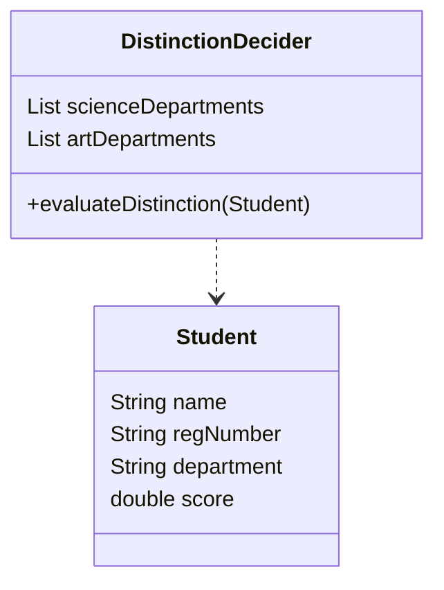
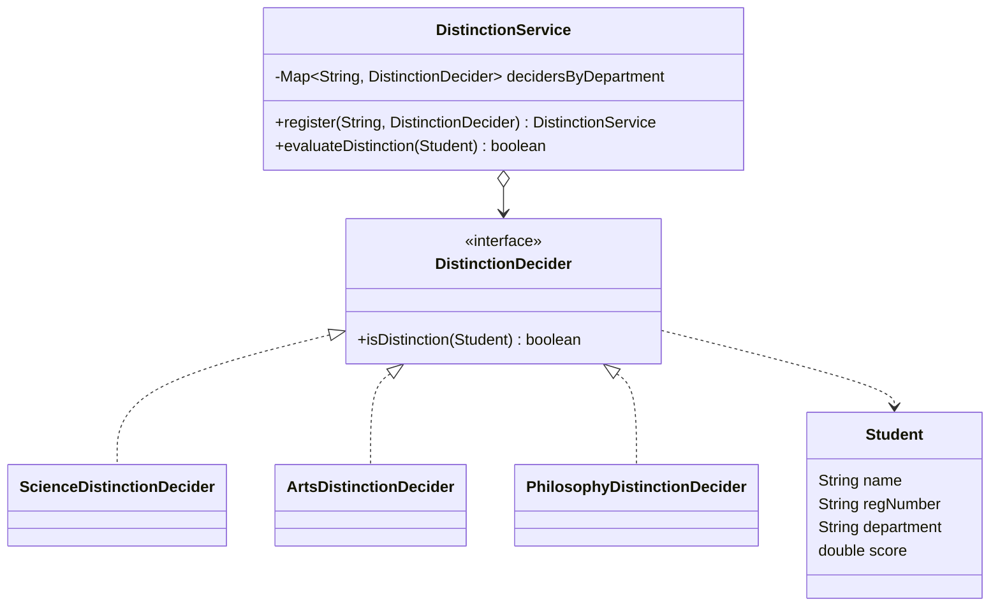

# Open/Closed Principle — Student Distinction

**Week 1 · SOLID principle**

## Intent
Software entities should be open for extension but closed for modification. You add new behaviour by writing new code, such as a new implementation of an abstraction, not by editing code that already works.

## The problem (`main`)
- `DistinctionDecider.evaluateDistinction()` hard-codes the department lists (`scienceDepartments`, `artDepartments`) and their thresholds (80 and 70) in one `if / else if` chain.
- A new faculty (for example Medicine with a 75 threshold) means editing and re-testing `DistinctionDecider`.
- Every rule lives in the same method, so a change to one rule risks breaking the others.

## The solution (`solution/solid-ocp-student`)
- `DistinctionDecider` becomes an interface with `boolean isDistinction(Student)`.
- `ScienceDistinctionDecider` (score ≥ 80) and `ArtsDistinctionDecider` (score ≥ 70) each hold one rule.
- `DistinctionService` keeps a registry from department to decider and prints/returns the result in `evaluateDistinction(Student)`. Departments are registered by the client, not hard-coded.
- A new rule is a new class plus one `register(...)` call: `PhilosophyDistinctionDecider` (score ≥ 75) was added this way. Existing deciders and the service are not touched.

## Before

## After

## Compare
[problem/solid-ocp-student...solution/solid-ocp-student](https://github.com/vamekh/ug-design-patterns-2025/compare/problem/solid-ocp-student...solution/solid-ocp-student)

## Discussion
- OCP is usually achieved with polymorphism: Strategy (week 9), Template Method, Decorator.
- Something still has to choose the right decider. Here `DistinctionService` does it with a department-to-decider map that is filled by registration, so adding a faculty never edits the service (compare the hard-coded lists in `main`).
- Cost: more types. Apply OCP where variation is expected, not up front for every `if`.
- Related: Strategy, Simple Factory (for picking the decider), LSP (every decider must honour the same contract).
