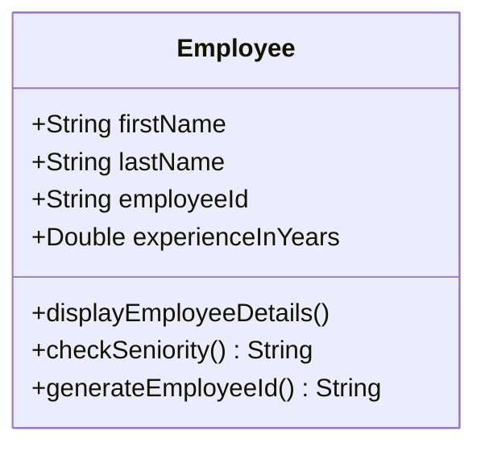
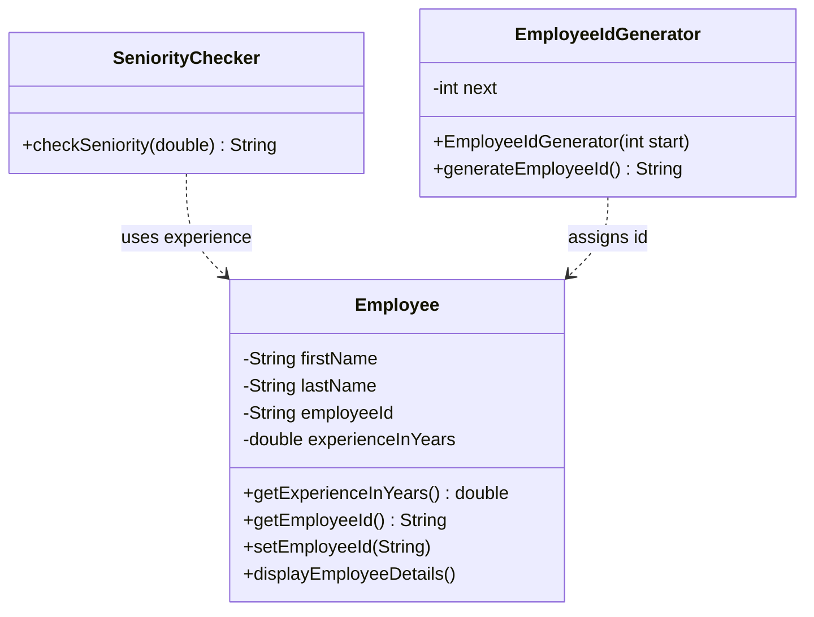

# Single Responsibility Principle — Employee

**Week 1 · SOLID principle**

## Intent
A class should have one reason to change. Each responsibility (a piece of policy that one group of stakeholders might want to change) belongs in its own class.

## The problem (`main`)
- `Employee` holds the employee's data and displays it, and it also decides seniority (`checkSeniority()`) and generates ids (`generateEmployeeId()`).
- A new seniority rule (HR), a new id format (IT) or a new display format all mean editing the same class.
- Id generation (`Math.random()`) and the seniority policy can't be reused or replaced without touching the data class.

## The solution (`solution/solid-srp-employee`)
- `Employee` keeps only its data (private fields with getters) and `displayEmployeeDetails()`.
- `SeniorityChecker.checkSeniority(double)` holds the seniority policy (5+ years means senior; negative experience is rejected).
- `EmployeeIdGenerator.generateEmployeeId()` holds the id format: a sequential counter (`EMP001`, `EMP002`, ...) with an injectable start value, so ids are unique and tests are deterministic.
- The client (`EmployeeTest`) combines the three classes. Each one can change without touching the others.

## Before

## After

## Compare
[problem/solid-srp-employee...solution/solid-srp-employee](https://github.com/vamekh/ug-design-patterns-2025/compare/problem/solid-srp-employee...solution/solid-srp-employee)

## Discussion
- "One reason to change" means one *actor* or policy, not "one method". Display and data can stay together while they always change together.
- Cost: more small classes, and the client has to put them together. Don't split code that has only one reason to change.
- Taken to the extreme, ignoring SRP produces a God Object (week 12). The fix is the same split, plus a thin orchestrator.
- Related: Facade (to hide the split from clients), DIP (inject `EmployeeIdGenerator` so tests can supply a deterministic one).
