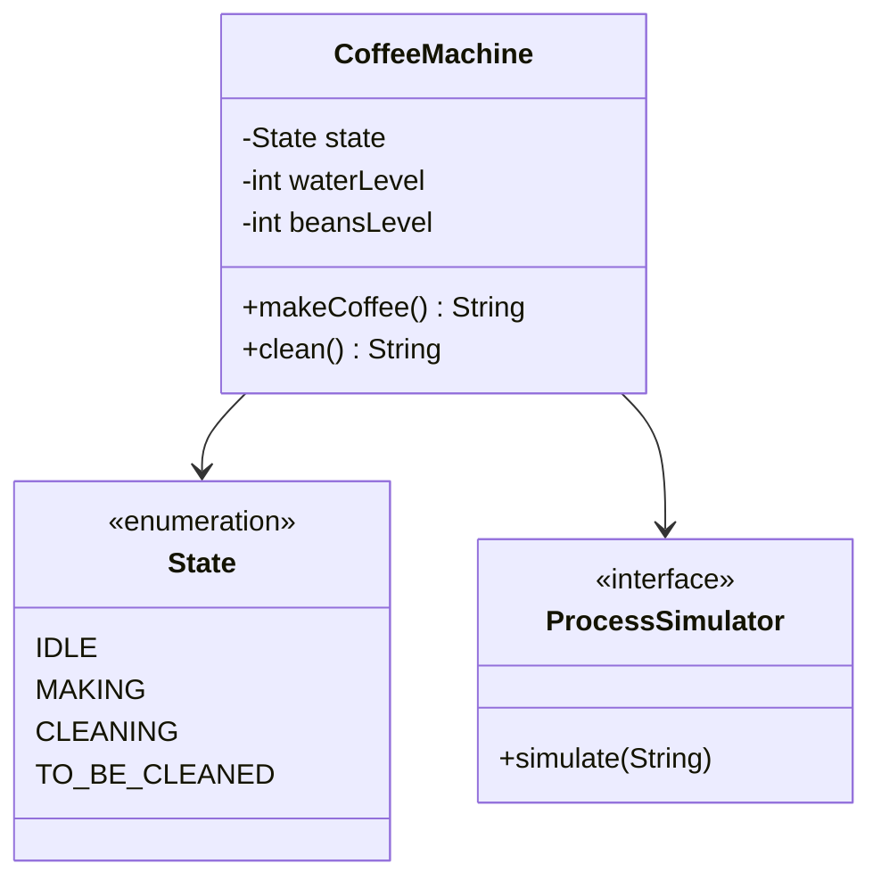
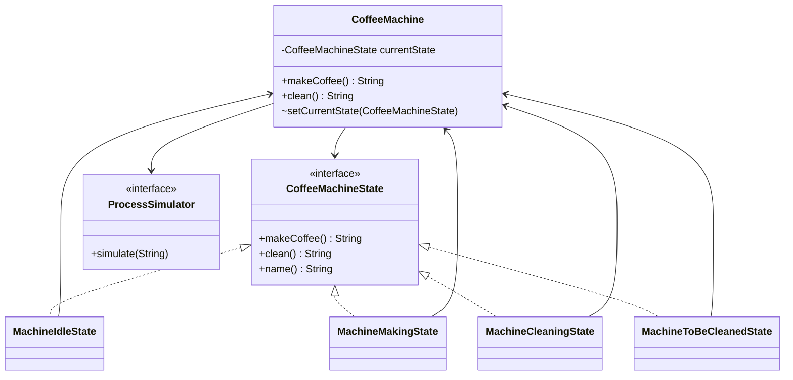

# State — Coffee Machine

**Week 9 · Behavioral**

## Intent
Let an object change its behaviour when its internal state changes, by delegating to a state object
instead of branching on a state flag.

## The problem (`main`)
- `CoffeeMachine` keeps a `State` enum (`IDLE`, `MAKING`, `CLEANING`, `TO_BE_CLEANED`).
- `makeCoffee()` and `clean()` each start with a `switch (state)`: the rules for one state are split across methods.
- Transitions (`state = State.X`) are buried inside the cases.
- Adding a state (e.g. `DESCALING`) or an action (e.g. `refill()`) means editing every switch.

## The solution (`solution/state-coffeemachine`)
- `CoffeeMachine` (context) holds a `CoffeeMachineState` and forwards `makeCoffee()` / `clean()` to it.
- `CoffeeMachineState` (state) declares the actions every state must answer.
- `MachineIdleState`, `MachineMakingState`, `MachineCleaningState`, `MachineToBeCleanedState` (concrete states) each hold the behaviour and the next transition for that state.
- "Needs cleaning" is a policy (every N cups) and `ProcessSimulator` is injected, so tests are deterministic (no `Math.random()`, threads or `Thread.sleep`).

## Before

## After

## Compare
[problem/state-coffeemachine...solution/state-coffeemachine](https://github.com/vamekh/ug-design-patterns-2025/compare/problem/state-coffeemachine...solution/state-coffeemachine)

## Discussion
- Use it when behaviour depends on state and the same `switch`/`if` on that state repeats in many methods.
- Cost: more classes, and states must know the context (or each other) to trigger transitions.
- A plain enum + switch is fine for two or three trivial states; State pays off as states and actions grow.
- Related: Strategy (same structure, but the client picks it; in State the object switches itself), Singleton/Flyweight for stateless state objects.
