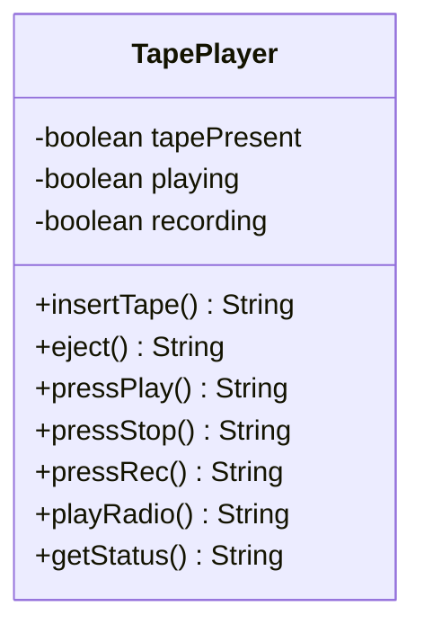
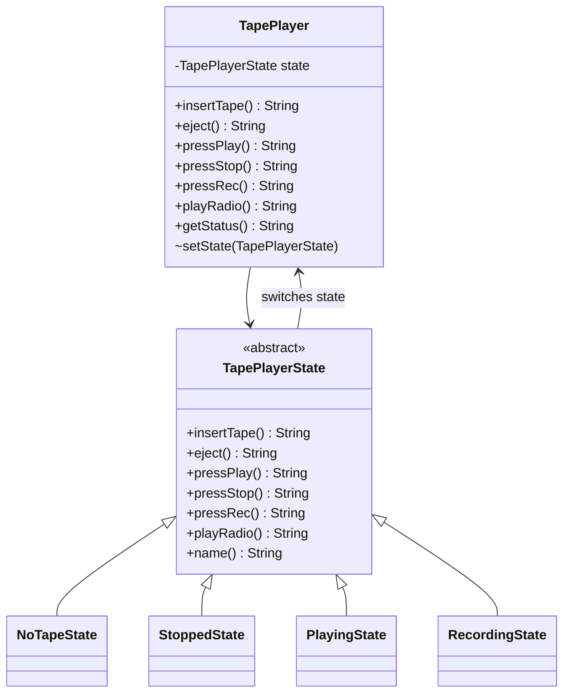

# State — Tape Player

**Week 9 · Behavioral**

## Intent
Let an object change its behaviour when its internal state changes, so it looks as if the object changed
its class.

## The problem (`main`)
- `TapePlayer` stores `tapePresent`, `playing` and `recording` booleans: 8 combinations for 4 real states.
- Every button (`pressPlay`, `pressStop`, `pressRec`, `playRadio`, `insertTape`, `eject`) re-checks the flags with its own if-chain.
- The rules for one mode (e.g. recording) are scattered across all six methods.
- Nothing prevents an invalid combination like `playing && recording`.

## The solution (`solution/state-tapeplayer`)
- `TapePlayer` (context) holds one `TapePlayerState` and delegates every button to it.
- `TapePlayerState` (state) is an abstract class with shared defaults (`insertTape` → "already inserted", `playRadio` → "Playing radio").
- `NoTapeState`, `StoppedState`, `PlayingState`, `RecordingState` (concrete states) return the message for each button and switch the player to the next state.
- `getStatus()` is simply the current state's name; invalid combinations can no longer exist.

## Before

## After

## Compare
[problem/state-tapeplayer...solution/state-tapeplayer](https://github.com/vamekh/ug-design-patterns-2025/compare/problem/state-tapeplayer...solution/state-tapeplayer)

## Discussion
- Use it when several boolean flags really encode one state machine; draw the state diagram first.
- Cost: a class per state and per-state copies of "not allowed here" answers (an abstract base with defaults helps).
- Transitions can live in the states (as here) or in the context; keeping them in the states keeps the context dumb.
- Related: Strategy (structurally the same), Flyweight/Singleton for stateless states, Memento for saving the current state.
