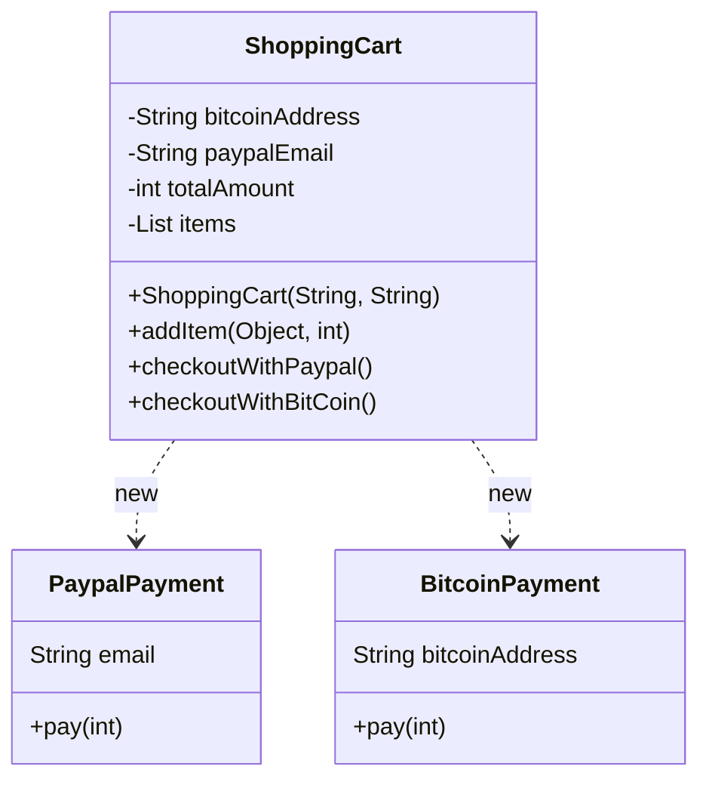
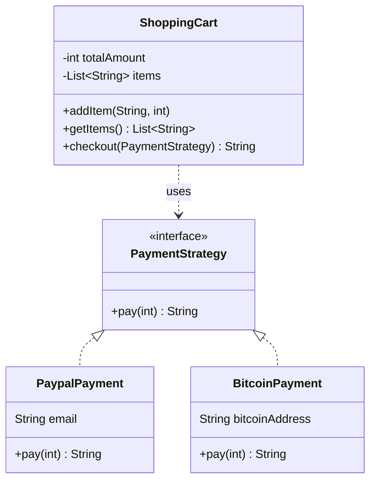

# Strategy — Shopping Cart

**Week 9 · Behavioral**

## Intent
Define a family of algorithms, encapsulate each one, and make them interchangeable. Strategy lets the algorithm vary independently of the clients that use it.

## The problem (`main`)
- `ShoppingCart` has one method per payment method, `checkoutWithPaypal()` and `checkoutWithBitCoin()`, and each creates its concrete payment class with `new`.
- The cart's constructor needs the credentials of *every* payment method (`bitcoinAddress`, `paypalEmail`), even though one checkout uses only one.
- `PaypalPayment` and `BitcoinPayment` share no type, so they can't be passed around or chosen at runtime.
- Adding card payments means editing `ShoppingCart`: a new field, a new constructor parameter and a new `checkoutWithX()` method.

## The solution (`solution/strategy-shopping-cart`)
- `PaymentStrategy` (Strategy) declares `String pay(int amount)`, which returns a receipt line (amount and method).
- `PaypalPayment` and `BitcoinPayment` (Concrete Strategies) implement it and carry their own credentials.
- `ShoppingCart` (Context) has a no-arg constructor and a single `checkout(PaymentStrategy)` that delegates to `strategy.pay(totalAmount)` and returns its receipt. `getItems()` exposes the added items.
- The test checks out the same cart with PayPal, Bitcoin and a lambda strategy and asserts each receipt.
- A new payment method is a new class. `ShoppingCart` is closed for modification.

## Before

## After

## Compare
[problem/strategy-shopping-cart...solution/strategy-shopping-cart](https://github.com/vamekh/ug-design-patterns-2025/compare/problem/strategy-shopping-cart...solution/strategy-shopping-cart)

## Discussion
- The client chooses the strategy and passes it in, here per call to `checkout()`. Alternatives are a constructor parameter or a setter when the strategy is long-lived.
- With a single-method strategy interface, Java lambdas can act as strategies (`cart.checkout(amount -> ...)`).
- Cost: clients must know that strategies exist and pick one. For two fixed, trivial variants an `enum` may be simpler (see Golden Hammer, week 12).
- Related: State (same structure, but the state switches itself), Template Method (varies steps through inheritance instead of composition), OCP and DIP.
