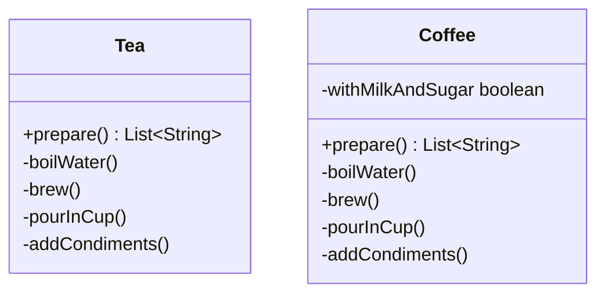
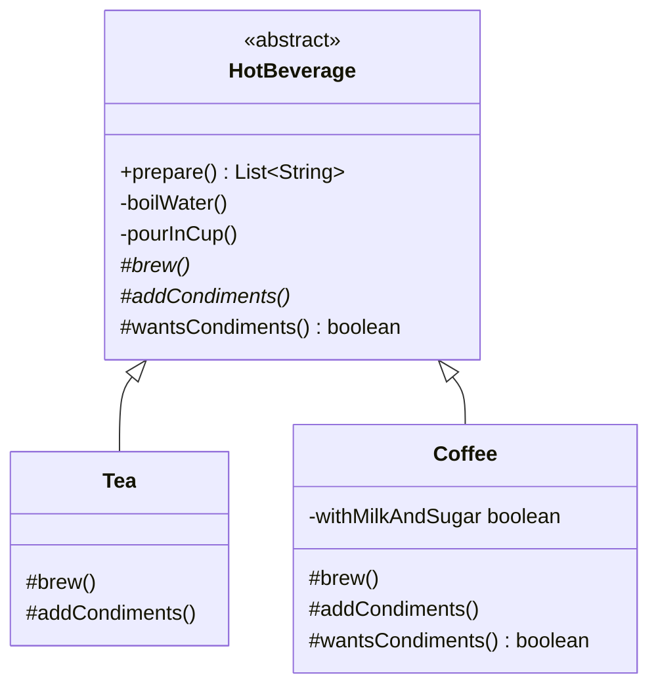

# Template Method — Beverage

**Week 6 · Behavioral**

## Intent
Define the skeleton of an algorithm in one method of a base class and let subclasses fill in some steps, without changing the order of the steps.

## The problem (`main`)
- `Tea.prepare()` and `Coffee.prepare()` each contain a full copy of the recipe.
- The shared steps `boilWater()` and `pourInCup()`, and the `step()` log, are duplicated in both classes.
- The copies have already drifted: `Coffee.prepare()` never calls `pourInCup()`.
- The "no condiments" option was added to `Coffee` only; `Tea` would need its own copy of the same `if`.

## The solution (`solution/template-method-beverage`)
- `HotBeverage` (abstract class) owns `final prepare()`, the template method that fixes the order of the steps.
- The shared steps `boilWater()` and `pourInCup()` are written once in `HotBeverage`.
- `brew()` and `addCondiments()` are abstract primitive operations. `Tea` and `Coffee` (concrete classes) implement them.
- `wantsCondiments()` is a hook that returns `true` by default. `Coffee` overrides it for black coffee.
- `prepare()` returns the list of steps, so the tests check the order.

## Before

## After

## Compare
[problem/template-method-beverage...solution/template-method-beverage](https://github.com/vamekh/ug-design-patterns-2025/compare/problem/template-method-beverage...solution/template-method-beverage)

## Discussion
- Use it when several classes run the same algorithm and differ only in a few steps.
- The base class calls the subclass ("Hollywood principle": don't call us, we'll call you). Making the template method `final` keeps subclasses from changing the order.
- Cost: it relies on inheritance, so a subclass is tied to its base class. Too many hooks make the flow hard to follow.
- Related: Strategy swaps the whole algorithm through composition, while Template Method swaps single steps through inheritance. Factory Method is often one step of a template method.
