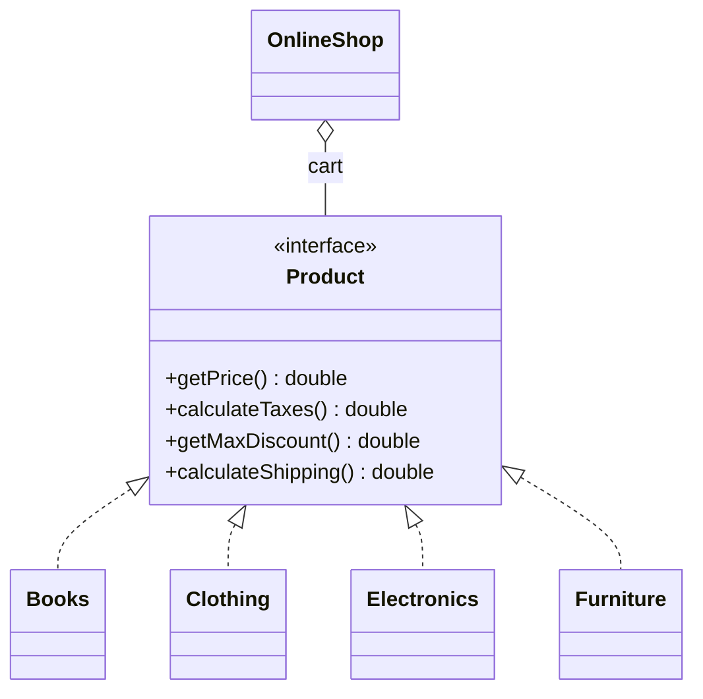
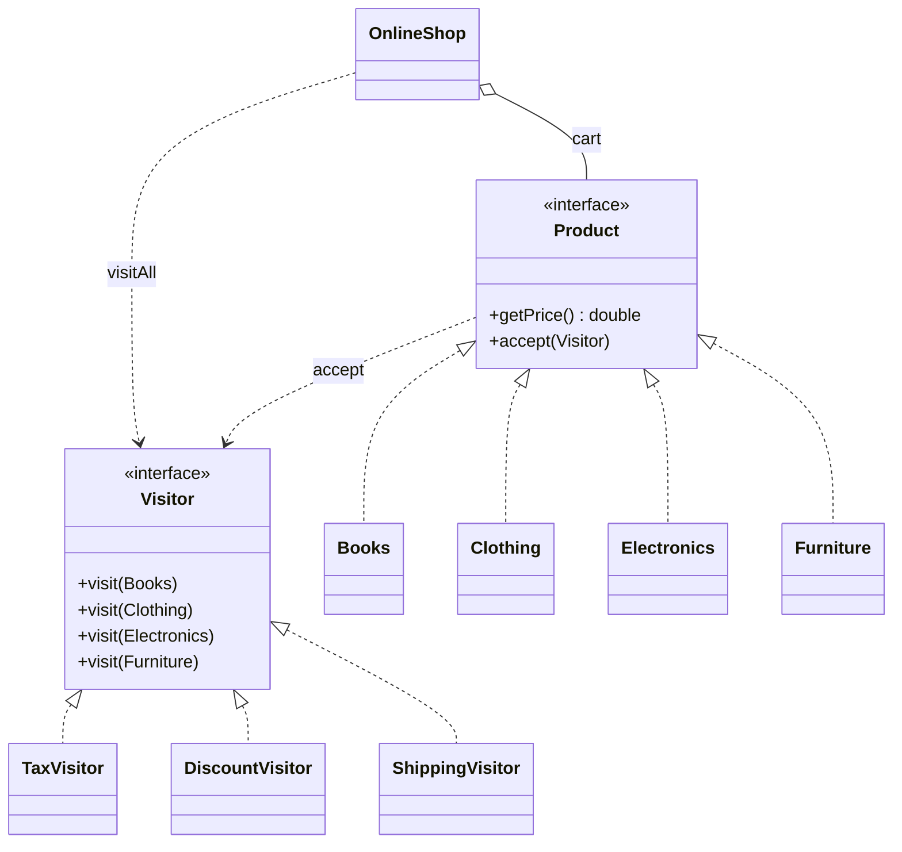

# Visitor — Ecommerce

**Week 10 · Behavioral**

## Intent
Represent an operation to be performed on the elements of an object structure as a separate object, so new operations can be added without changing the element classes.

## The problem (`main`)
- `Product` declares `calculateTaxes()`, `getMaxDiscount()` and `calculateShipping()`, and it gets a new method for every new business rule.
- Every new operation means editing `Product` and all four classes: `Books`, `Clothing`, `Electronics`, `Furniture`.
- The tax, discount and shipping rules are spread across the product classes, so the full tax policy is never in one place.
- `OnlineShop` loops over the cart and calls a different product method for each total.

## The solution (`solution/visitor-ecommerce`)
- `Visitor` (Visitor) declares one `visit(...)` overload per concrete product.
- `TaxVisitor`, `DiscountVisitor`, `ShippingVisitor` (Concrete Visitors) each hold one operation and add up a `getTotal()`.
- `Product` (Element) now has only `getPrice()` and `accept(Visitor)`, and each product calls `visitor.visit(this)` (double dispatch).
- `OnlineShop` (Client) runs a visitor over the cart in `visitAll(visitor)` and reads its total.
- Adding an operation means adding one new visitor class. The test does this with a `CountingVisitor`.

## Before

## After

## Compare
[problem/visitor-ecommerce...solution/visitor-ecommerce](https://github.com/vamekh/ug-design-patterns-2025/compare/problem/visitor-ecommerce...solution/visitor-ecommerce)

## Discussion
- Visitor works well when the element classes are stable and new operations keep arriving, as with tax, shipping, export or insurance rules.
- The cost is that adding a new product type (e.g. `Food`) means editing `Visitor` and every concrete visitor. Visitor turns the "which side is easy to extend" trade-off around.
- Visitors often need elements to expose their state (`getPrice()`), which weakens encapsulation a little.
- Related: Composite (visitors often walk composite structures), Iterator (`visitAll` walks the cart).
