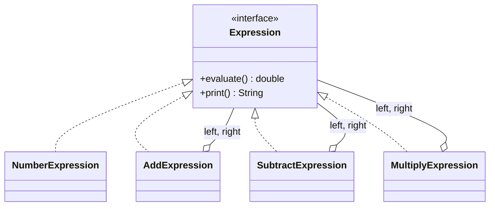
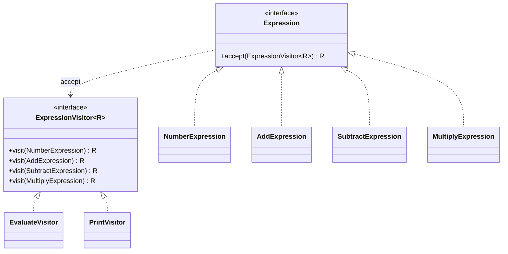

# Visitor — Expression

**Week 10 · Behavioral**

## Intent
Define new operations over an expression tree (evaluate, print, ...) without changing the classes of the tree nodes.

## The problem (`main`)
- `Expression` declares both `evaluate()` and `print()`.
- `NumberExpression`, `AddExpression`, `SubtractExpression` and `MultiplyExpression` each implement both, so the code for one operation is spread over four classes.
- A third operation (derive, simplify, count nodes) means editing the interface and all four classes again.

## The solution (`solution/visitor-expression`)
- `ExpressionVisitor<R>` (Visitor) has one `visit(...)` per node type and returns a result of type `R`.
- `EvaluateVisitor` (`ExpressionVisitor<Double>`) computes the value: `(3 + 4) * 2 = 14.0`.
- `PrintVisitor` (`ExpressionVisitor<String>`) renders `((10 - 3) * (2 + 1))`.
- The expressions (Elements) only implement `<R> R accept(ExpressionVisitor<R> visitor)` and expose their children/value.
- The test adds a node-counting visitor as an anonymous class, and no expression class changes.

## Before

## After

## Compare
[problem/visitor-expression...solution/visitor-expression](https://github.com/vamekh/ug-design-patterns-2025/compare/problem/visitor-expression...solution/visitor-expression)

## Discussion
- A generic return type (`ExpressionVisitor<R>`) lets each visitor return its result directly instead of storing it in a field.
- This connects to Interpreter: the problem version *is* Interpreter (each node interprets itself). Visitor is the better choice when you expect many operations over a fixed grammar.
- Adding a node type (e.g. `DivideExpression`) now touches every visitor. That is the usual Visitor trade-off.
- Related: Interpreter, Composite.
