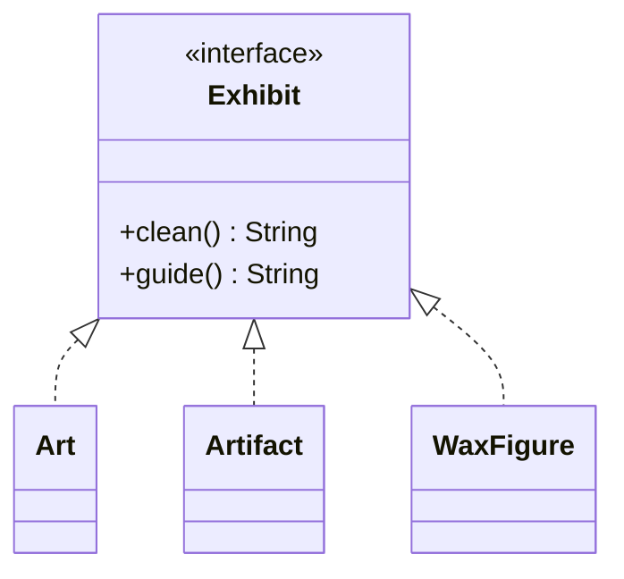
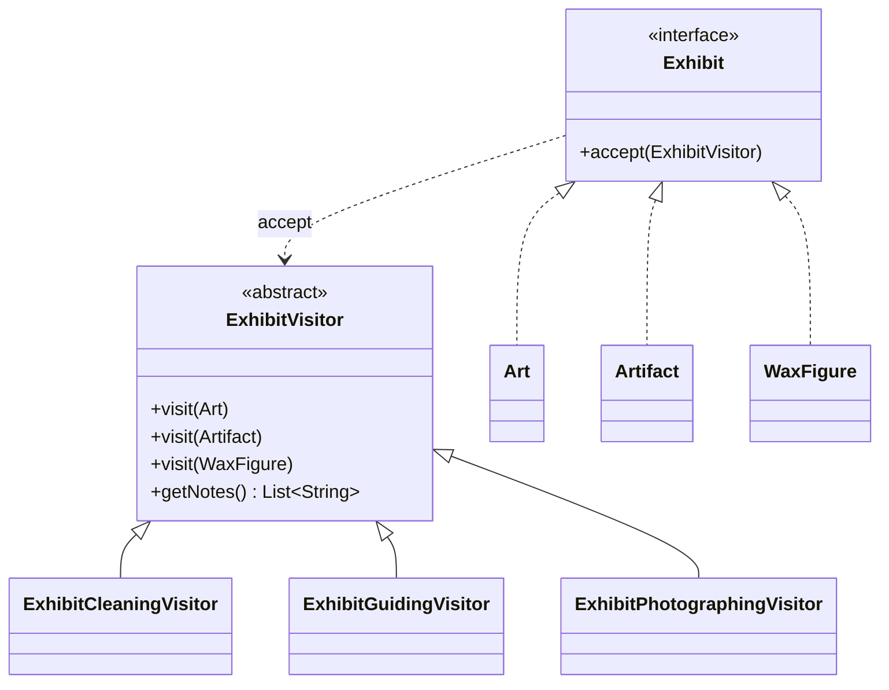

# Visitor — Tour Guide

**Week 10 · Behavioral**

## Intent
Separate an operation from the objects it works on, so that new operations (staff activities) can be added without changing the exhibit classes.

## The problem (`main`)
- `Exhibit` declares `clean()` and `guide()`, so every exhibit class carries the logic of every staff member.
- `Art`, `Artifact` and `WaxFigure` mix unrelated concerns: cleaning rules and guiding text sit next to each other.
- Letting a photographer in means adding `photograph()` to `Exhibit` and to all three exhibit classes.

## The solution (`solution/visitor-tourguide`)
- `ExhibitVisitor` (Visitor) declares `visit(Art)`, `visit(Artifact)` and `visit(WaxFigure)`, and keeps the notes the staff member records.
- `ExhibitCleaningVisitor` and `ExhibitGuidingVisitor` (Concrete Visitors) contain the old `clean()` and `guide()` logic.
- `ExhibitPhotographingVisitor` is the new activity. It was added without touching any exhibit.
- `Exhibit` (Element) has only `accept(ExhibitVisitor)`, and each exhibit calls `visitor.visit(this)`.

## Before

## After

## Compare
[problem/visitor-tourguide...solution/visitor-tourguide](https://github.com/vamekh/ug-design-patterns-2025/compare/problem/visitor-tourguide...solution/visitor-tourguide)

## Discussion
- Each "person walking through the museum" is a visitor, and the exhibits only open the door (`accept`).
- `ExhibitVisitor` is an abstract class here so the shared note list is written once. A plain interface works just as well.
- Adding a new exhibit type (e.g. `Fossil`) is now the expensive change, because every visitor needs a new `visit` method.
- Related: Composite (museum wings containing exhibits), Command.
